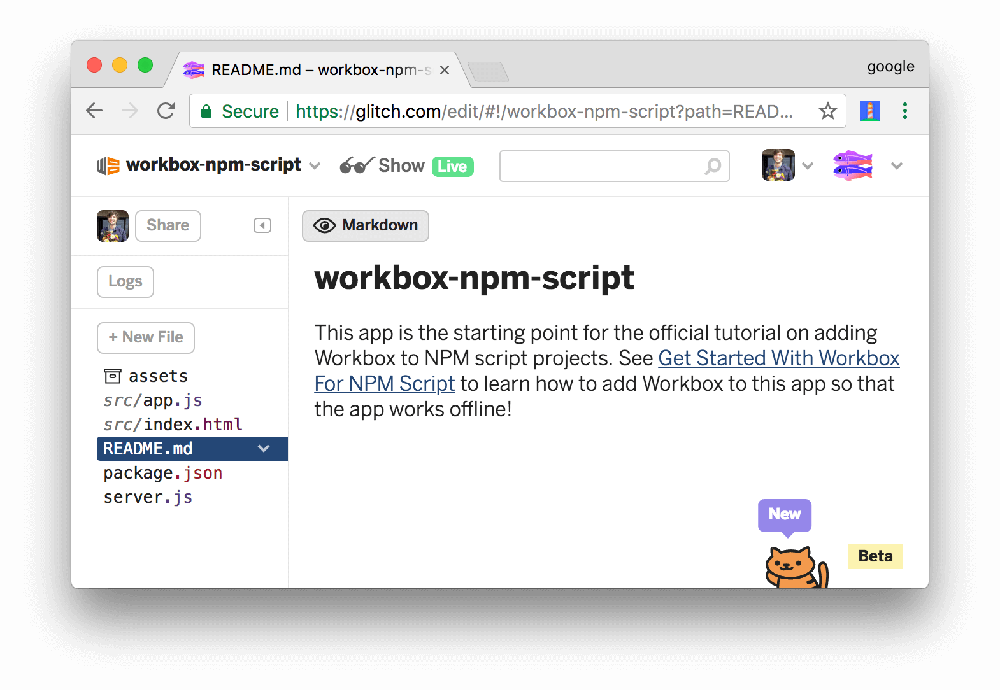
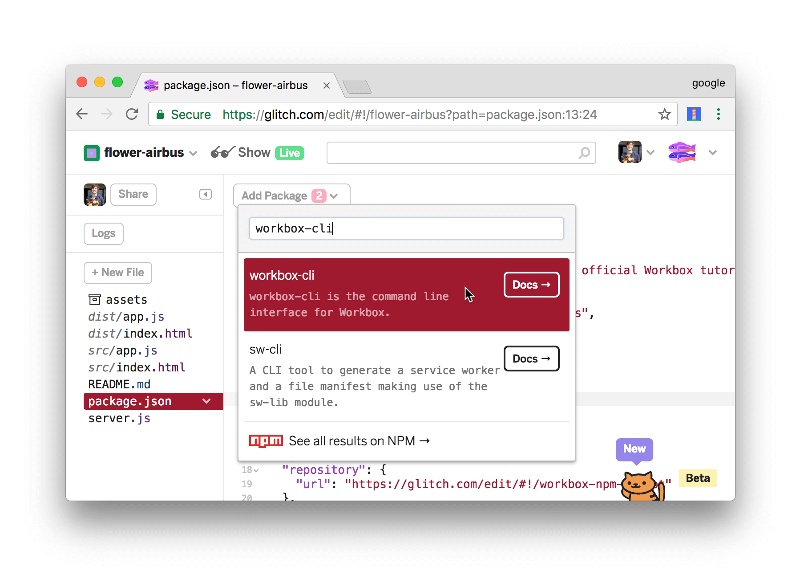

project_path: /web/tools/workbox/_project.yaml book_path: /web/tools/workbox/_book.yaml description: Learn how to make an npm-script-based app work offline by adding Workbox to it.

{# wf_updated_on: 2018-03-13 #} {# wf_published_on: 2017-12-27 #} {# wf_blink_components: N/A #}

# Get Started With Workbox For npm Script {: .page-title }



In this codelab, you use Workbox to make a simple web app work offline.

If you'd like a conceptual overview of Workbox before starting this tutorial, see the [Overview](/web/tools/workbox/overview).

## Step 1: Set up your project {: #setup }

The project that you're going to add Workbox to is hosted on [Glitch](https://glitch.com/about/). First, you need to set up Glitch so that you can edit your own copy of the project.

1. Open the [demo](https://glitch.com/edit/#!/workbox-npm-script).
    
    <figure> 
    
     <figcaption> **Figure 1**. The starting point demo, hosted on Glitch </figcaption> </figure>
2. Click **workbox-npm-script** at the top-left of the page. The **Project info and options** dropdown appears.

3. Click **Remix This**. Your browser redirects to an editable copy of the project.

<<_shared/try-initial.md>>

## Step 2: Install Workbox {: #install }

Next, you're going to add Workbox to the project to enable an offline experience.

1. Re-focus the tab that shows you the source code of the project.
2. Click `package.json` to open that file.
3. Click **Add package**.
4. Type `workbox-cli` within the **Add Package** text box, then click on the matching package to add it to the project.
    
    <aside class="note">**Note**: This is equivalent to running `npm install workbox-cli`. In your own projects, you'll probably want to save Workbox as a \[development dependency\]\[devDependencies\] instead by running `npm install workbox-cli --save-dev`, since `workbox-cli` is a build-time tool.</aside> 
    
    <figure> 
    
     <figcaption> **Figure 5**. Adding the `workbox-cli` package </figcaption> </figure>

Every time you make a change to your code, Glitch automatically re-builds and re-deploys your app. The tab running the live app automatically refreshes, too.

## Step 3: Add Workbox to your npm Script build process {: #npm-script }

Workbox is installed, but you're not using it in your build process, yet.

1. Click **New File**, type `workbox-config.js`, then press <kbd>Enter</kbd>.
2. Add the following code to `workbox-config.js`.
    
    <pre class="prettyprint">module.exports = {
  globDirectory: './dist/',
  globPatterns: [
    '\*\*/\*.{html,js}'
  ],
  swDest: './dist/sw.js',
  clientsClaim: true,
  skipWaiting: true
};</pre>
3. Open `package.json`.

4. Update your npm `scripts` to call Workbox as the last step in your build process. The bold code is what you need to add.
    
    
    
    <pre class="prettyprint">{
   ...
   "scripts": {
     ...
     "build": "npm run clean && npm run copy <strong>&& workbox generateSW</strong>"
   }
   ...
 }</pre>

### Optional: How the config works {: #optional-config }

The `build` script in `package.json` controls how the app is built. The build script calls Workbox (`workbox generateSW`) as the last step.

The `workbox generateSW` command automatically searches for a Workbox config file called `workbox-config.js` in the current working directory. If it finds one, it uses that config. Otherwise, a CLI wizard prompts you to configure how Workbox runs.

The object that you define in `workbox-config.js` configures how Workbox runs.

<<_shared/config.md>>

<<_shared/register.md>>

## Step 5: Add runtime caching {: #runtime }

Runtime caching lets you store content that's not under your control when your app requests it at runtime. For example, by runtime caching the Hacker News content which this app relies on, you'll be able to provide an improved offline experience for your users. When users visit the app while offline, they'll be able to see the content from the last time that they had an internet connection.

1. Re-focus the tab that shows you the source code of your project.
2. Open `workbox-config.js` again.
3. Add a `runtimeCaching` property to your Workbox configuration. `urlPattern` is a regular expression pattern telling Workbox which URLs to store locally. `handler` defines the caching strategy that Workbox uses for any matching URL. See [The Offline Cookbook](/web/fundamentals/instant-and-offline/offline-cookbook/) for more on caching strategies.
    
    <pre class="prettyprint">module.exports = {
  ...
  <strong>runtimeCaching: [{
    urlPattern: new RegExp('https://hacker-news.firebaseio.com'),
    handler: 'staleWhileRevalidate'
  }]</strong>
}</pre>

<<_shared/try-complete.md>>

<<_shared/create.md>>

1. Open `workbox-config.js`.
2. Remove the `runtimeCaching`, `clientsClaim`, and `skipWaiting` properties. These are now handled in your service worker code.
3. Add the `swSrc` property to instruct Workbox to inject its code into a custom service worker. The complete `workbox-config.js` file now looks like this:
    
    <pre class="prettyprint">module.exports = {
  globDirectory: './dist/',
  globPatterns: [
    '\*\*/\*.{html,js}'
  ],
  swDest: './dist/sw.js',
  swSrc: './src/sw.js'
};</pre>
4. Open `package.json`.

5. In your build script, change `generateSW` to `injectManifest`.
    
    
    
    <pre class="prettyprint">{
   ...
   "scripts": {
     ...
     "build": "npm run clean && npm run copy && workbox <strong>injectManifest</strong>"
   }
   ...
 }</pre>

<<_shared/end.md>>