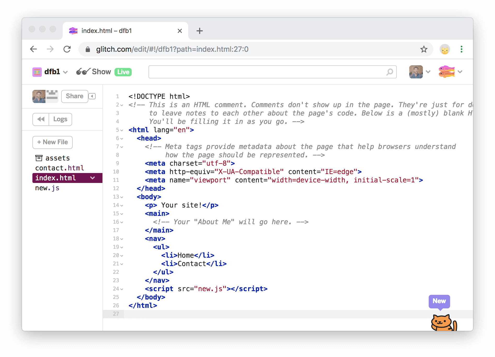
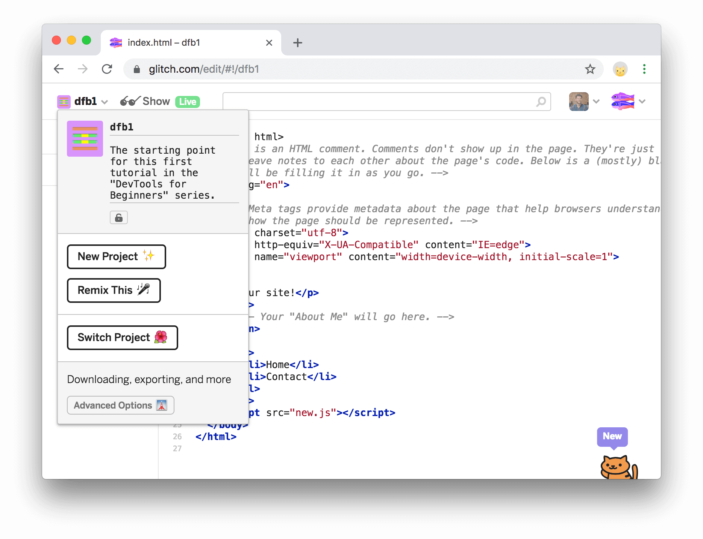
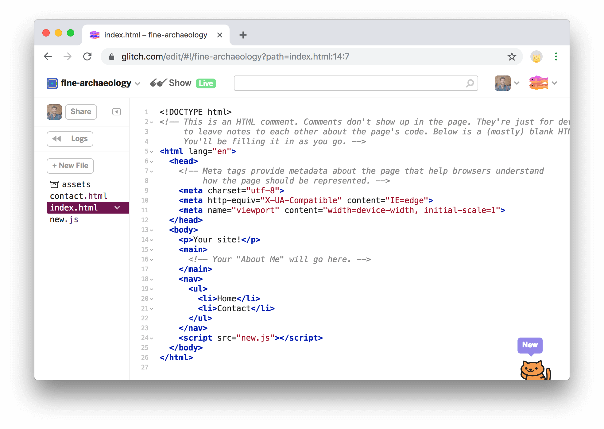
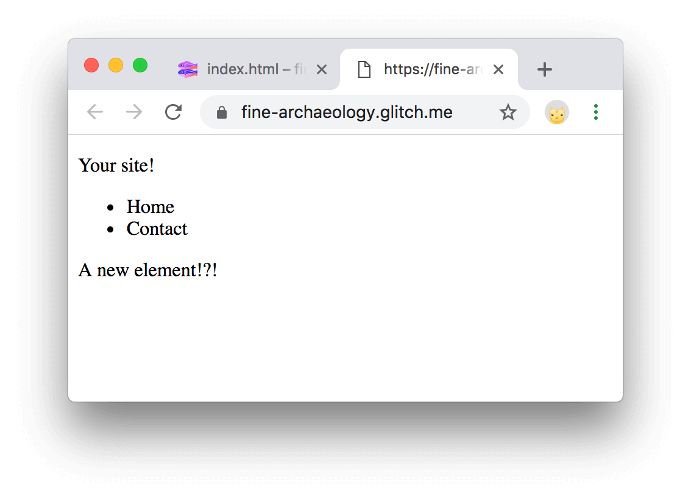

project_path: /web/tools/_project.yaml book_path: /web/tools/_book.yaml

{# wf_updated_on: 2018-12-19 #} {# wf_published_on: 2018-08-13 #} {# wf_blink_components: Platform>DevTools #}

# DevTools for Beginners: Get Started with HTML and the DOM {: .page-title }



This is the first in a series of tutorials that teach you the basics of web development. You will also learn about a set of web developer tools called Chrome DevTools that can increase your productivity.

In this particular tutorial, you learn about HTML and the DOM. HTML is one of the core technologies of web development. It is the language that controls the structure and content of webpages. The DOM is also related to the structure and content of webpages, but you'll learn more about that later.

## Goals {: #goals }

You are going to learn web development by actually building your own website. By the time you complete all of the tutorials in the *DevTools for Beginners* series, your finished site will look like **Figure 1**.

<figure>
  
  <figcaption>
    <b>Figure 1</b>. The finished site
  </figcaption>
</figure>

By the end of this tutorial, you will understand:

* How HTML and the DOM create the content that you see on webpages.
* How Chrome DevTools can help you experiment with HTML and DOM changes.
* The difference between HTML and the DOM.

You'll also have a real website! You can use this site to host your resume or blog.

## Prerequisites {: #prerequisites }

Before attempting this tutorial, complete the following prerequisites:

* If you're unfamiliar with HTML, read [Getting Started with HTML](https://developer.mozilla.org/en-US/docs/Learn/HTML/Introduction_to_HTML/Getting_started){: .external }.
* Download the [Google Chrome](https://www.google.com/chrome/){: .external } web browser. This tutorial uses a set of web development tools, called Chrome DevTools, that are built into Google Chrome.

## Set up your code {: #setup}

You're going to build your site in an online code editor called Glitch.

1. Open the <a class="external gc-analytics-event" target="_blank" rel="noopener"
data-category="CTA" data-label="/web/tools/chrome-devtools/beginners/html"
href="https://glitch.com/edit/#!/dfb1?path=index.html">source code</a>. This tab will be called the **editor tab** throughout this tutorial.
    
    <figure> 
    
     <figcaption> **Figure 2**. The editor tab </figcaption> </figure>
2. Click **dfb1**. The Project Options menu opens in the top-left corner.
    
    <figure> 
    
     <figcaption> **Figure 3**. The Project Options menu </figcaption> </figure>
3. Click **Remix This**. Glitch creates a copy of the project that you can edit and randomly generates a new name for the project. The content is the same as before.
    
    <figure> 
    
     <figcaption> **Figure 4**. The remixed project </figcaption> </figure>
4. If you plan on completing the next tutorial in this series, click **Sign In** and sign in to Glitch with your GitHub or Facebook account. If you don't sign in you will lose the ability to edit this project once you close the editing tab.

5. Click **Show Live**. A new tab opens, showing you the live page. This tab will be called the **live tab** throughout this tutorial.
    
    <figure> 
    
     <figcaption> **Figure 5**. The live tab </figcaption> </figure>

## Add content {: #add }

Your site is pretty empty. Follow the steps below to add some content to it!

1. In the **editor tab**, replace `<!-- You're "About Me" will go here. -->` with `<h1>About Me</h1>`.
    
    <pre class="prettyprint lang-html">...

  

  Your site!

  <main>

<strong>
    

<h1>
  About Me
</h1>
  </strong></main>
  ...</pre>

  

<figure>
   

   <figcaption>
     <b>Figure 6</b>. The new code is highlighted in the editor tab
   </figcaption>
 </figure></li>

<li>
  

    View your changes in the <strong>live tab</strong>. The text <code>About Me</code> is visible on the page.
    It's larger than the rest of the text, because the <code>&lt;h1&gt;</code> element represents
    a section heading. Your web browser automatically styles headings in larger
    font sizes.
  

  
  
  

    
  

  
  <figure>
     
  
     <figcaption>
       <b>Figure 7</b>. The new heading is visible in the live tab
     </figcaption>
   </figure>
</li>

<li>
  

    Back in the <strong>editor tab</strong>, insert <code>&lt;p&gt;I am learning HTML. Recent accomplishments:&lt;/p&gt;</code> on the line below
    where you just put <code>&lt;h1&gt;About Me&lt;/h1&gt;</code>.
  

  
  
  <pre class="prettyprint lang-html">...

  

  Your site!

  <main>
    

<h1>
  About Me
</h1>

<strong>
    

  I am learning web development. Recent accomplishments:


  </strong></main>
  ...</pre>

  

<figure>
   

   <figcaption>
     <b>Figure 8</b>. The new code is highlighted in the editor tab
   </figcaption>
 </figure></li>

<li>
  

    View your change in the <strong>live tab</strong>.
  

</li>

<li>
  

    Back in the <strong>editor tab</strong>, add a list of your accomplishments:
  

  
  
  <pre class="prettyprint lang-html">...
  

  I am learning web development. Recent accomplishments:



<strong>
  

<ul>
  <li>
    Learned how to set up my code in Glitch.
  </li>
      
  
  <li>
    Added content to my HTML.
  </li>
      
  
  <li>
    TODO: Learn how to use Chrome DevTools to experiment with content changes.
  </li>
      
  
  <li>
    TODO: Learn the difference between HTML and the DOM.
  </li>
    
</ul></strong>
...</pre>
  
  
  
  

    
  

  
  <figure>
     
  
     <figcaption>
       <b>Figure 4</b>. The new code is highlighted in the editor tab
     </figcaption>
   </figure>
</li>

<li>
  

    Again, go back to the <strong>live tab</strong> to make sure that the new content is displaying correctly.
  

  
  
  

    
  

  
  <figure>
     
  
     <figcaption>
       <b>Figure 4</b>. The new list is visible in the live tab
     </figcaption>
   </figure>
</li>
</ol>

<h2>
  Experiment with content changes in Chrome DevTools {: #experiment }
</h2>

  If you were developing a big page with a lot of HTML, you can imagine that it might be
  somewhat tedious to go back-and-forth between the editor tab and the live tab hundreds of times
  in order to see your changes, especially if you weren't sure what exactly to put on the page.
  Chrome DevTools can help you experiment with content changes without ever leaving the live tab.

<h3>
  Learn the difference between HTML and the DOM {: #DOM }
</h3>

  Before you start editing your content from Chrome DevTools, it's helpful to understand
  the difference between HTML and the DOM. The best way to learn is by example:

<ol start="1">
  <li>
    

      Go to the <strong>live tab</strong>. At the bottom of your page you see the text <code>A new element!?!</code>.
    

    
    
    

      
    

    
    <figure>
       
    
       <figcaption>
         <b>Figure 9</b>. At the bottom of the page the text <code>A new element!?!</code> can
         be seen
       </figcaption>
     </figure>
  </li>
  
  
  <li>
    

      Go back to the <strong>editor tab</strong> and try to find this text in <code>index.html</code>. It's not there!
    

    
    
    

      
    

    
    <figure>
       
    
       <figcaption>
         <b>Figure 10</b>. The mystery text <code>A new element!?!</code> is nowhere to
         be found in <code>index.html</code>
       </figcaption>
     </figure>
  </li>
  
  
  <li>
    

      Go back to the <strong>live tab</strong>, right-click <code>A new element!?!</code>, and select <strong>Inspect</strong>.
    

    
    
    

      
    

    
    <figure>
       
    
       <figcaption>
         <b>Figure 11</b>. Inspecting some text
       </figcaption>
     </figure>
    
    

      DevTools opens up alongside your page. <code>&lt;div&gt;A new element!?!&lt;/div&gt;</code> is highlighted blue.
      Although this structure in DevTools looks like your HTML, it is actually the <strong>DOM Tree</strong>.
    

    
    
    

      
    

    
    <figure>
       
    
       <figcaption>
         <b>Figure 12</b>. DevTools is open alongside the page
       </figcaption>
     </figure>
  </li>
  
</ol>

  When your page loads, the browser takes your HTML to create the <em>initial</em> content of the page. The
  DOM represents the <em>current</em> content of the page, which can change over time.
  The mysterious <code>&lt;div&gt;A new element!?!&lt;/div</code> content is added to your page because of the
  <code>&lt;script src="new.js"&gt;&lt;/script&gt;</code> tag at the bottom of your HTML. This tag causes some JavaScript
  code to run. You'll learn more about JavaScript in a later tutorial, but for now think of it as a
  programming language that can change the content of your page. In this particular case, JavaScript
  code adds <code>&lt;div&gt;A new element!?!&lt;/div&gt;</code> to your page. That is why this mystery text is visible on
  your live page, but not in your HTML.

<h3>
  Edit the DOM {: #edit }
</h3>

  If you want to quickly experiment with content changes without ever leaving the live tab,
  try DevTools.

<ol start="1">
  <li>
    

      In DevTools, right-click <code>Your site!</code> and select <strong>Edit as HTML</strong>.
    

    
    
    

      
    

    
    <figure>
       
    
       <figcaption>
         <b>Figure 13</b>. Editing the node as HTML
       </figcaption>
     </figure>
  </li>
  
  
  <li>
    

      Replace <code>&lt;p&gt;Your site!&lt;/p&gt;</code> with the code below.
    

    
    
    <pre class="prettyprint lang-html">
&lt;header>
  

  <b>Welcome to my site!</b>

  

<button>Download my resume</button>
&lt;/header>
</pre>
    
    
    

      
    

    
    <figure>
       
    
       <figcaption>
         <b>Figure 14</b>. Editing the node as HTML
       </figcaption>
     </figure>
  </li>
  
  
  <li>
    

      Press <kbd>Command</kbd>+<kbd>Enter</kbd> (Mac) or <kbd>Control</kbd>+<kbd>Enter</kbd>
      (Windows, Linux, Chrome OS) to save your changes, or click outside of the box.
      Your changes automatically show up in the live view of your page. The text <code>Your site!</code>
      has been replaced with the new content.
    

    
    
    

      
    

    
    <figure>
       
    
       <figcaption>
         <b>Figure 15</b>. The new content shows up immediately on the page
       </figcaption>
     </figure>
  </li>
  
</ol>

  This workflow is only good for experimenting with content changes. If you reload the page or close the
  tab, your changes will be gone forever. If you're using this workflow and you want to save your changes,
  you need to manually copy those changes over to your HTML.

  The next couple of sections show you some more ways that you can change content from the DOM Tree.

<h2>
  Reorder nodes {: #reorder }
</h2>

  You can also change the order of DOM nodes. For example, on your web page the navigation menu is near the
  bottom. To move it to the top:

<ol start="1">
  <li>
    

      Find the <code>&lt;nav&gt;</code> node in the <strong>DOM Tree</strong> of DevTools.
    

    
    
    

      
    

    
    <figure>
       
    
       <figcaption>
         <b>Figure 16</b>. The nav node is highlighted blue in DevTools
       </figcaption>
     </figure>
  </li>
  
  
  <li>
    

      Drag the <code>&lt;nav&gt;</code> node to the top, so that it's the first child below the <code>&lt;body&gt;</code> node.
    

    
    
    

      
    

    
    <figure>
       
    
       <figcaption>
         <b>Figure 17</b>. Dragging the nav node to the top
       </figcaption>
     </figure>
    
    

      The <code>&lt;nav&gt;</code> node is now displaying at the top of your page.
    

    
    
    

      
    

    
    <figure>
       
    
       <figcaption>
         <b>Figure 18</b>. The nav node is at the top of the page
       </figcaption>
     </figure>
  </li>
  
</ol>

<h3>
  Delete a node {: #delete }
</h3>

  You can also remove nodes from the DOM Tree.

<ol start="1">
  <li>
    

      In the <strong>DOM Tree</strong>, click <code>&lt;div&gt;A new element!?!&lt;/div&gt;</code>. DevTools highlights the node blue.
    

    
    
    

      
    

    
    <figure>
       
    
       <figcaption>
         <b>Figure 19</b>. Selecting the node to be deleted
       </figcaption>
     </figure>
  </li>
  
  
  <li>
    

      Press the <kbd>Delete</kbd> key on your keyboard. The <code>&lt;div&gt;A new element!?!&lt;/div&gt;</code> node is removed
      from your DOM Tree.
    

    
    
    

      
    

    
    <figure>
       
    
       <figcaption>
         <b>Figure 20</b>. The node has been deleted
       </figcaption>
     </figure>
  </li>
  
</ol>

<h2>
  Copy your changes {: #copy }
</h2>

  You're almost done. You've made a few changes to your page in DevTools, but they're not yet saved to your
  source code.

<ol start="1">
  <li>
    

      Reload your <strong>live tab</strong>. The changes that you made in the DOM Tree disappear. In particular,
      the text <code>Your site!</code> returns to the top of the page, and the text <code>A new element!?!</code> returns to the
      bottom.
    

    
    
    

      
    

    
    <figure>
       
    
       <figcaption>
         <b>Figure 21</b>. The changes that you've made are gone
       </figcaption>
     </figure>
  </li>
  
  
  <li>
    

      Copy the code below.
    

    
    
    <pre class="prettyprint notranslate lang-html">
&lt;!DOCTYPE html&gt;
&lt;html lang="en"&gt;
  &lt;head&gt;
    &lt;meta charset="utf-8"&gt;
    &lt;meta http-equiv="X-UA-Compatible" content="IE=edge"&gt;
    &lt;meta name="viewport" content="width=device-width, initial-scale=1"&gt;
  &lt;/head&gt;
  &lt;body&gt;
    &lt;header&gt;
      &lt;p&gt;Welcome to my site!&lt;/p&gt;
    &lt;/header&gt;
    &lt;nav&gt;
      &lt;ul&gt;
        &lt;li&gt;&lt;a href="/"&gt;Home&lt;/a&gt;&lt;/li&gt;
        &lt;li&gt;&lt;a href="/contact.html"&gt;Contact&lt;/a&gt;&lt;/li&gt;
      &lt;/ul&gt;
    &lt;/nav&gt;
    &lt;main&gt;
      &lt;h1&gt;About Me&lt;/h1&gt;
      &lt;p&gt;I am learning web development. Recent accomplishments:&lt;/p&gt;
      &lt;ul&gt;
        &lt;li&gt;Learned how to set up my code in Glitch.&lt;/li&gt;
        &lt;li&gt;Added content to my HTML.&lt;/li&gt;
        &lt;li&gt;Learned how to use Chrome DevTools to experiment with content changes.&lt;/li&gt;
        &lt;li&gt;Learned the difference between HTML and the DOM.&lt;/li&gt;
      &lt;/ul&gt;
    &lt;/main&gt;
  &lt;/body&gt;
&lt;/html&gt;
</pre>
  </li>
  
  
  <li>
    

      Go back to the <strong>editor tab</strong> and replace the contents of your <code>index.html</code> file with the code that
      you just copied.
    

    
    
    

      
    

    
    <figure>
       
    
       <figcaption>
         <b>Figure 22</b>. How your <code>index.html</code> file should look
       </figcaption>
     </figure>
  </li>
  
</ol>

<h2>
  Next steps {: #next-steps}
</h2>

<ul>
  <li>
    Complete the next tutorial in this series, <a href="css">Get Started with CSS</a>, to learn how to style your page
    and experiment with style changes in Chrome DevTools.
  </li>
  
  
  <li>
    Read <a href="https://developer.mozilla.org/en-US/docs/Web/API/Document_Object_Model/Introduction">Introduction to the DOM</a>{: .external } to learn more about the DOM.
  </li>
  
  
  <li>
    Check out a course like <a href="https://www.coursera.org/learn/web-development">Introduction to Web Development</a>{: .external } to get
    more hands-on web development experience.
  </li>
  
</ul>

<h2>
  Feedback {: #feedback }
</h2>

  

