project_path: /web/_project.yaml book_path: /web/ilt/pwa/_book.yaml

{# wf_auto_generated #} {# wf_updated_on: 2017-09-28 #} {# wf_published_on: 2016-01-01 #}

# Tools for PWA Developers {: .page-title }

## Open Developer Tools

### Chrome

To access **Developer Tools** ("[DevTools](/web/tools/chrome-devtools/)") in Chrome, open a web page or web app in Google Chrome. Click the **Chrome menu**  icon, and then select **More Tools** > **Developer Tools**.

You can also use the keyboard shortcut <kbd>Control+Shift+I</kbd> on Windows and Linux, or <kbd>⌘+alt+I</kbd> on Mac (see the [Keyboard and UI Shortcuts Reference](/web/tools/chrome-devtools/inspect-styles/shortcuts)). Alternatively, right-click anywhere on the page and select Inspect.

On a Mac, you can also select **View** > **Developer** > **Developer Tools** in the Chrome menu bar at the top of the screen.

The **DevTools** window opens in your Chrome browser.

### Firefox

To open Developer Tools in Firefox, open a web page or web app in Firefox. Click the Menu icon  in the browser toolbar, and then click **Developer** > **Toggle Tools**.

You can also use the keyboard shortcut <kbd>Control+Shift+I</kbd> on Windows and Linux, or <kbd>⌘ + alt + I</kbd> on Mac (see the [Keyboard Shortcuts Reference](https://developer.mozilla.org/en-US/docs/Tools/Keyboard_shortcuts)).

On Mac, you can also select **View __> __Web Developer __> __Toggle Tools** in the Firefox menu bar at the top of the screen.

The **Toolbox** window opens in your Firefox browser.

### Opera

To launch **Opera Dragonfly**, open a web page or web app in Opera. Use the keyboard shortcut <kbd>Ctrl + Shift + I</kbd> on Windows and Linux, or <kbd>⌘ + alt + I</kbd> on Mac. Alternatively, you can target a specific element by right-clicking in the page and selecting "Inspect Element".

On a Mac, you can also select **View > Show Developer Menu** in the Opera menu bar at the top of the screen. Then select **Developer > Developer Tools**.

The **Dragonfly** window opens in your Opera browser.

### Internet Explorer

To open Developer Tools in Internet Explorer, open a web page or web app in Internet Explorer. Press <kbd>F12</kbd> or click **Developer Tools** from the **Tools** menu.

### Safari

To start using **Web Inspector** in Safari, open a web page or web app in Safari. In the menu bar, select **Safari** > **Preferences**. Go to the **Advanced** pane and enable the "Show Develop menu in menu bar" setting. In the menu bar, select **Develop** > **Show Web Inspector**.

You can also use the keyboard shortcut <kbd>⌘ + ⌥ + I</kbd>.

The **Web Inspector** window opens in your Safari browser.

## Open the console

### Chrome

To open the dedicated **Console** panel, either:

* Press <kbd>Ctrl + Shift + J</kbd> (Windows / Linux) or <kbd>⌘ + ⌥ + J</kbd> (Mac).
* [Open **DevTools**](#chromedevtools) and select the **Console** panel.

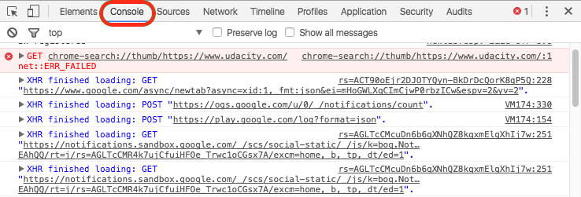

See [Using the Console](/web/tools/chrome-devtools/console/) for more information.

### Firefox

To open the Web Console, either:

* Press <kbd>Ctrl + Shift + K</kbd> (Windows/Linux) or <kbd>⌘ + ⌥ + K</kbd> (Mac).
* From the Firefox menu (or Tools menu if you display the menu bar or are on Mac OS X), select __Developer > Web Console. __
* [Open the **Toolbox**](#firefoxdevtools) and select the **Console** panel.

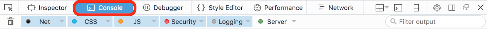

See [Opening the Web Console](https://developer.mozilla.org/en-US/docs/Tools/Web_Console/Opening_the_Web_Console) for more information.

### Opera

[Open **Dragonfly**](#operadevtools) and select the **Console** panel.

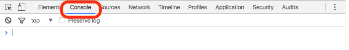

### Internet Explorer

[Open Developer Tools](#iedevtools) and select the **Console** panel.

### Safari

To open the **Console**, either:

* [Enable the Developer menu](#safaridevtools). From the menu bar, select **Develop** > **Show Error Console**.
* Press <kbd>⌘ + ⌥ + C</kbd>
* [Open the Web Inspector](#safaridevtools) and select the **Console** panel.

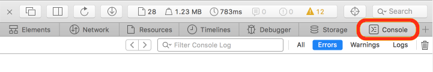

## Work with the network

### View network requests

#### Chrome

[Open **DevTools**](#chromedevtools) and select the **Network** panel. Requests are displayed in the **Network** panel's **Requests Table**. See [Measure Resource Loading Times](/web/tools/chrome-devtools/network-performance/resource-loading?utm_source=dcc&utm_medium=redirect&utm_campaign=2016q3) for more information.

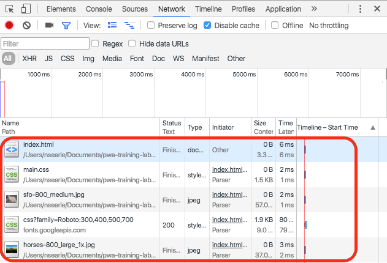

#### Firefox

[Open the **Toolbox**](#firefoxdevtools) and select the **Network** panel. See [Network Monitor](https://developer.mozilla.org/en-US/docs/Tools/Network_Monitor) for more information.

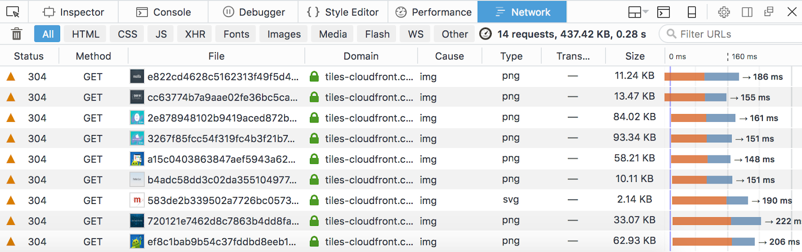

#### Opera

See [View Network Requests in Chrome](#chromerequests).

#### Internet Explorer

[Open Developer Tools](#iedevtools), and then open the **Network** panel. See [Network](https://developer.microsoft.com/en-us/microsoft-edge/platform/documentation/f12-devtools-guide/network/) for more information.

#### Safari

[Open the **Web Inspector**](#safaridevtools), and then open the **Network** panel.

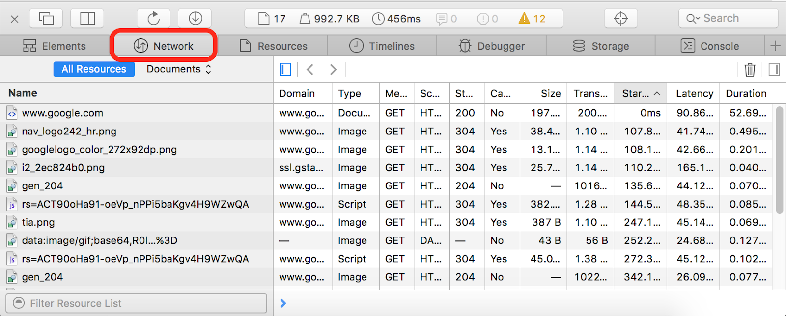

### Simulate offline behavior

#### Chrome

[Open **DevTools**](#chromedevtools) and select the **Network** panel. Check the **Offline** checkbox. Check out [Optimize Performance Under Varying Network Conditions](/web/tools/chrome-devtools/network-performance/network-conditions) for more information.

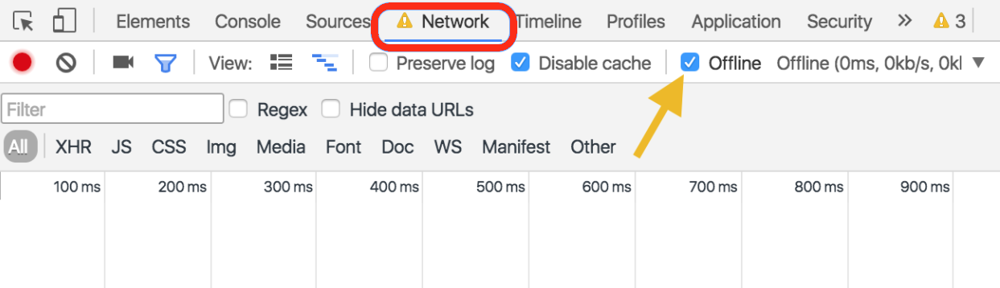

#### Firefox

Click menu icon  in the browser toolbar. Then click **Developer** > **Work Offline**.

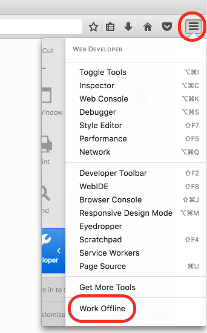

On Mac, you can enable offline mode from the menu bar by clicking **File** > **Work Offline**.

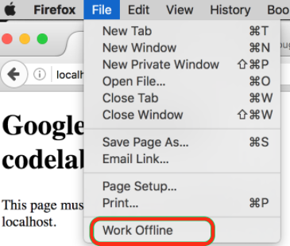

## Inspect the manifest

#### Chrome

[Open **DevTools**](#chromedevtools) in Chrome. Click the **Application** panel, and then click **Manifest** in the navigation bar.

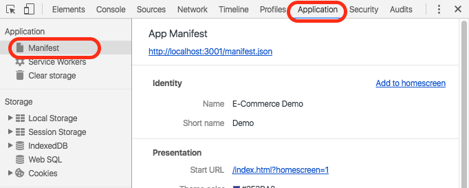

If your app has a **manifest.json** file, the options you have defined will be listed here.

You can test the add to homescreen feature from this pane. Click **Add to homescreen**. You should see an "add this site to your shelf" message.

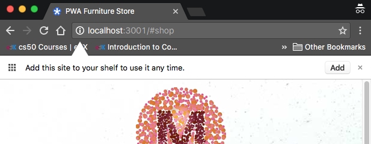

## Interact with service workers in the browser

### Inspect the service worker

#### Chrome

[Open **DevTools**](#chromedevtools) in Chrome. Click the **Application** panel, and then click **Service Workers** in the navigation bar.

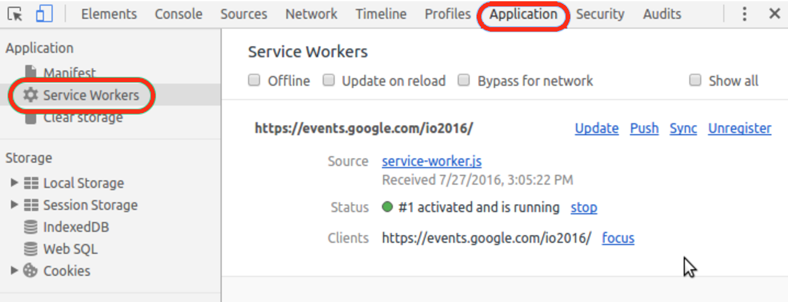

If a service worker is installed for the currently open page, you'll see it listed on this pane. For example, in the screenshot above there's a service worker installed for the scope of `https://events.google.com/io2016/`.

#### chrome://serviceworker-internals/

You can also view a list of all service workers by navigating to **chrome://serviceworker-internals/** in your Chrome browser.

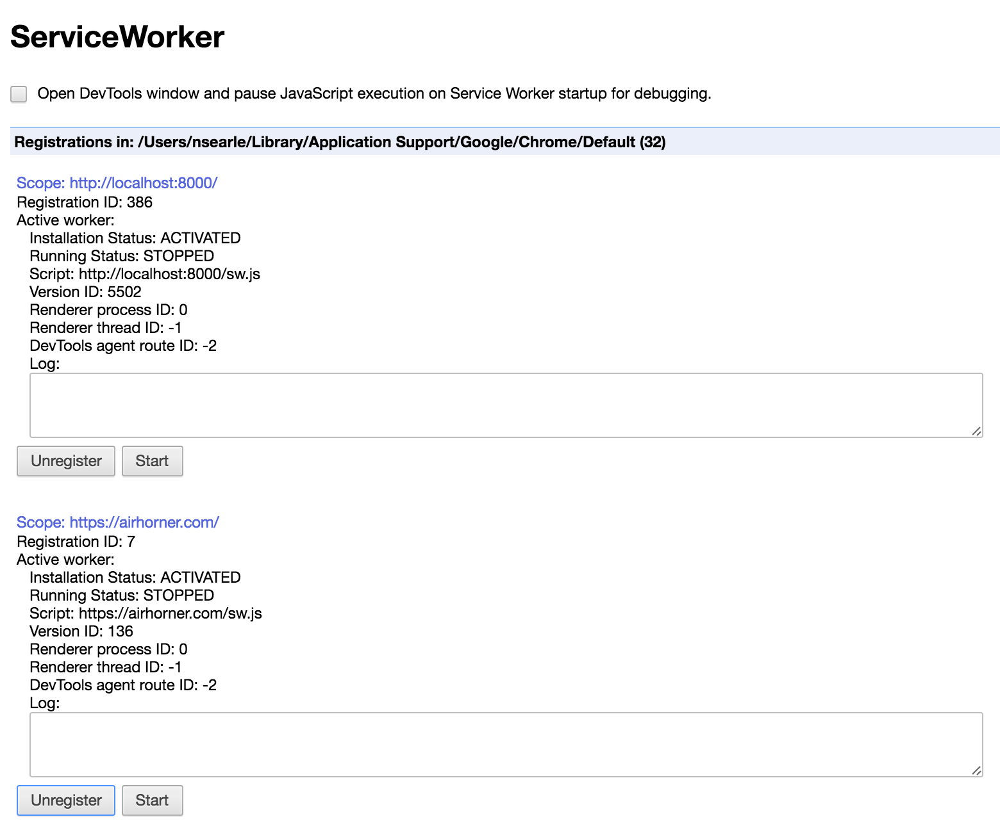

#### Firefox

The **about:debugging** page provides an interface for interacting with Service Workers.

There are several different ways to open **about:debugging**:

* On Mac, in the **Tools** > **Web Developer** menu, click **Service Workers**.
* Click the Menu icon  in the browser toolbar.

Then click the Developer icon  and select **Service Workers**.

* Enter "about:debugging" in the Firefox URL bar and click **Workers**.

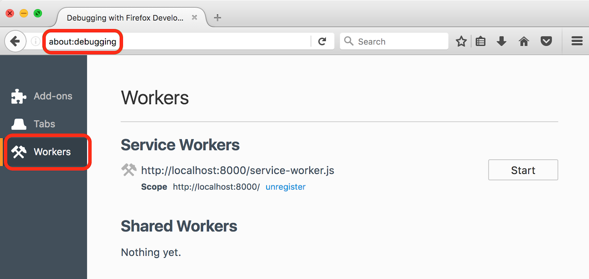

### Unregister the service worker

#### Chrome

[Open the Service Workers pane](#chromesw) in **DevTools**. Click **Unregister** next to the service worker.

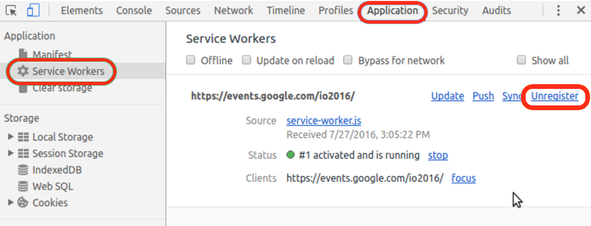

#### Firefox

[Open the Workers page in **about:debugging**](#firefoxsw). Click **Unregister** next to the service worker scope.

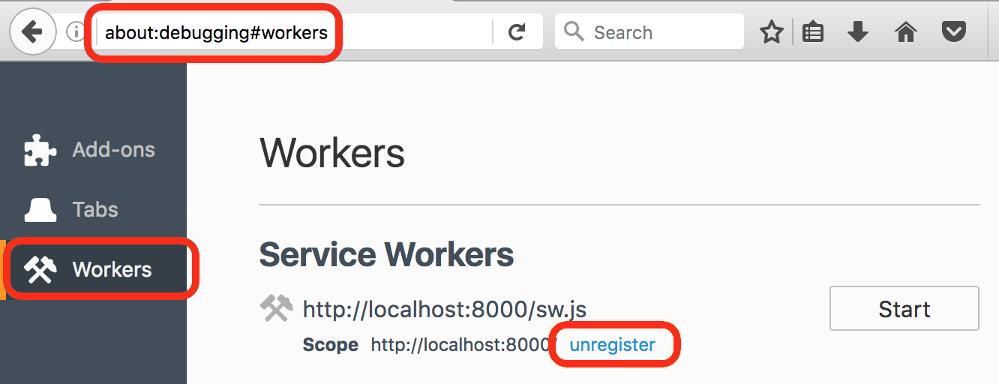

### Force update the service worker

#### Chrome

There are several ways to force-update the service worker in Chrome:

1. Refresh your app in the browser so the new service worker is recognized. Then hold <kbd>Shift</kbd> and click the Reload icon  .
2. [Open the Service Workers pane](#chromesw) in **DevTools**. Click **Update**. When the new service worker installs, click **skipWaiting**.

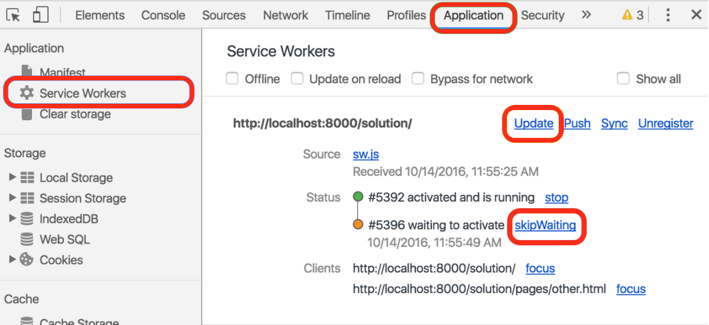

3. To force the service worker to update automatically whenever you reload the page, check **Update on reload**.

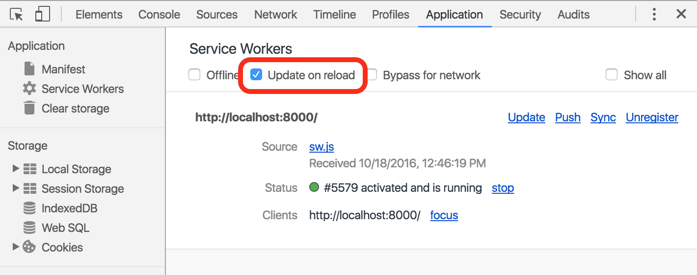

4. [Unregister the service worker](#chromeunregister) and refresh the app in the browser.

#### Firefox

To update the service worker in Firefox, close all pages controlled by the service worker and then reopen them. The service worker only updates when there are no pages open in Firefox that are within its scope.

If you want to be absolutely certain (for testing reasons) that the service worker will update, you can [unregister the service worker](#firefoxunregister) from the **about:debugging** page and refresh your app in the browser. The new service worker installs on page reload.

Note that unregistering the service worker will change the subscription object if you are working with Push Notifications. Be sure to use the new subscription object if you unregister the service worker.

### Send simulated push notifications

#### Chrome

[Open the Service Workers pane](#chromesw) in **DevTools**. Click **Push** to ping the service worker.

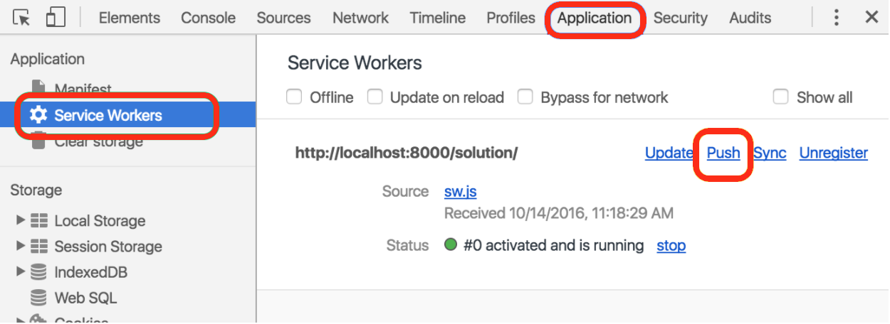

#### Firefox

Navigate to **about:debugging** in Firefox and select **Workers**. Click **Push**. If the worker isn't running, you will see **Start** instead of **Push**. Click **Start** to start the service worker, then click **Push**.

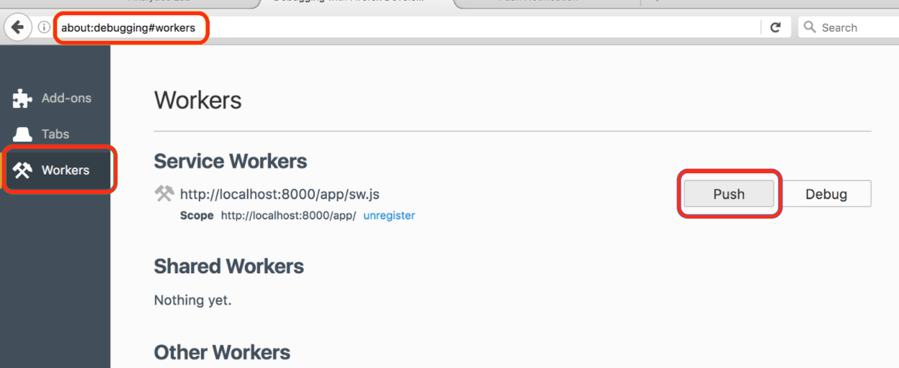

## Check notification permissions

### Chrome

Click the Information icon in the URL bar. Use the **Notifications** dropdown menu to set the permission status for **Notifications**.

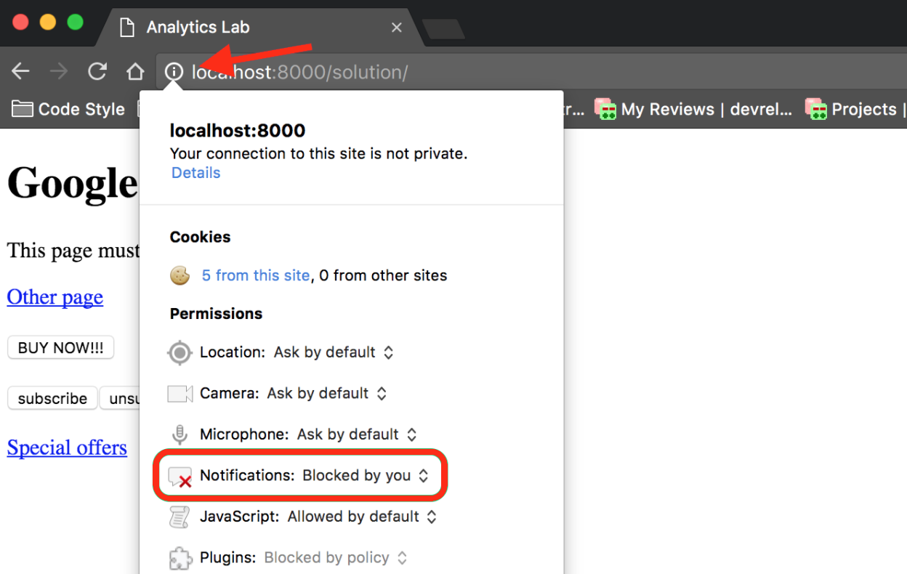

### Firefox

Click the Information icon in the URL bar. Use the **Receive Notifications** dropdown menu to set the permission status for notifications.

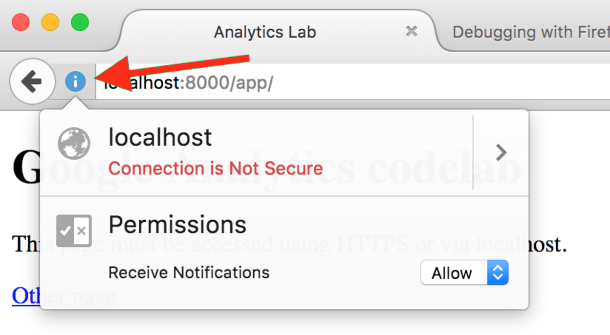

## Inspect cache storage

### Check the service worker cache

#### Chrome

[Open **DevTools**](#chromedevtools) and select the **Application** panel. In the navigation bar click **Cache Storage** to see a list of caches. Click a specific cache to see the resources it contains.

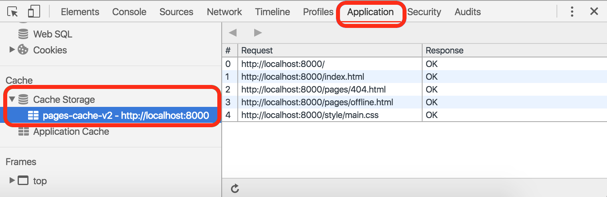

#### Firefox

[Open the **Toolbox**](#firefoxdevtools) and click the Settings icon to open **Settings**. Under **Default Firefox Developer Tools**, check **Storage**.

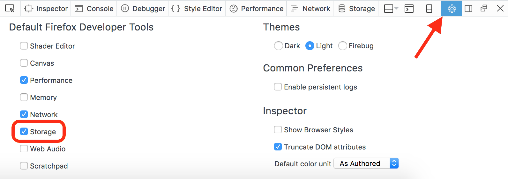

Open the **Storage** panel and expand the **Cache Storage** node. Select a cache to see its contents.

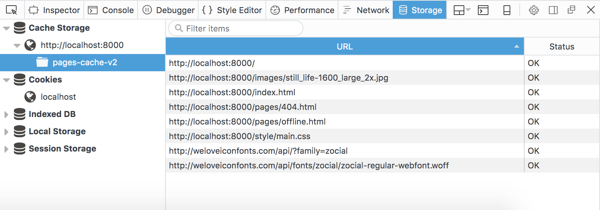

See the MDN article on the [Storage Inspector](https://developer.mozilla.org/en-US/docs/Tools/Storage_Inspector) for more information.

### Clear the service worker cache

#### Chrome

[Go to **Cache Storage**](#chromecache) in **DevTools**. In the **Application** panel, expand **Cache Storage**. Right-click the cache name and then select **Delete**.

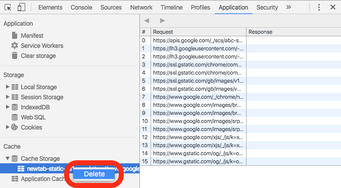

#### Firefox

[Go to **Cache Storage**](#firefoxcache) in **DevTools**. In the **Storage** panel, expand **Cache Storage** and the appropriate domain. Right-click the cache name and then select **Delete All**.

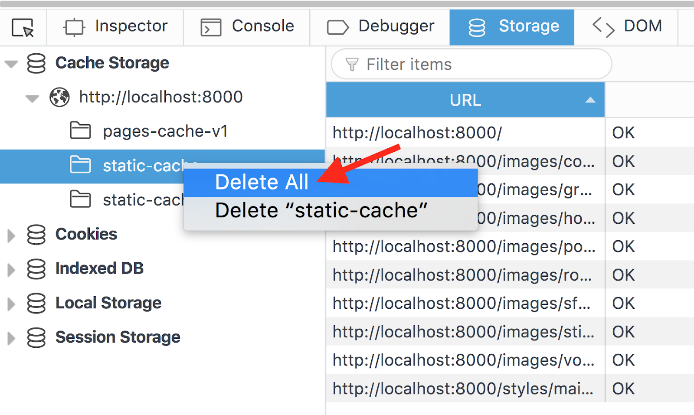

### Check IndexedDB

#### Chrome

In **DevTools**, navigate to the **Application** tab. Select **IndexedDB**. You may need to click Reload  to update the contents.

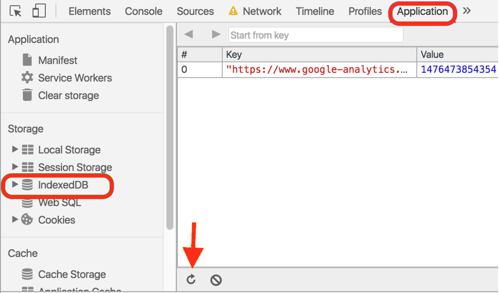

#### Firefox

[Open the **Toolbox**](#firefoxdevtools) and click the Settings icon to open **Settings**. Under **Default Firefox Developer Tools, __check __Storage**.

Open the **Storage** panel and expand the **IndexedDB** node. Select a database, object store, or index to see its contents.

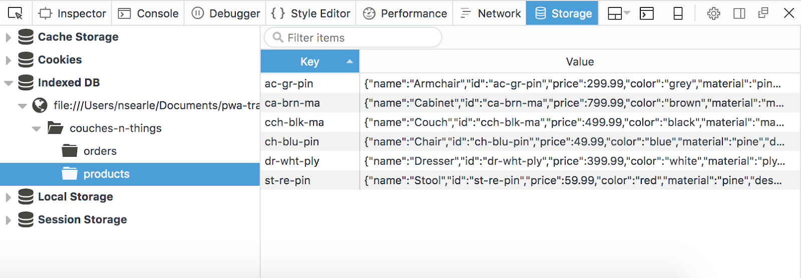

### Clear IndexedDB

In all browsers that support IndexedDB, you can delete a database by entering the following in the console:

`indexedDB.deleteDatabase('database_name');`

Where `database_name` is the name of the database to delete.

#### Chrome

[Open **IndexedDB**](#chromeindexeddb) in **DevTools**. In the navigation pane, expand **IndexedDB**, right-click the object store to clear, and then click **Clear**.

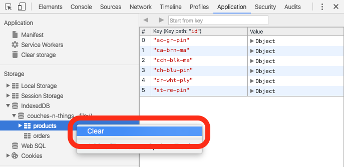

### Disable HTTP Cache

#### Chrome

[Open **DevTools**](#chromedevtools) and open the **Network** panel. Check the **Disable cache** checkbox.

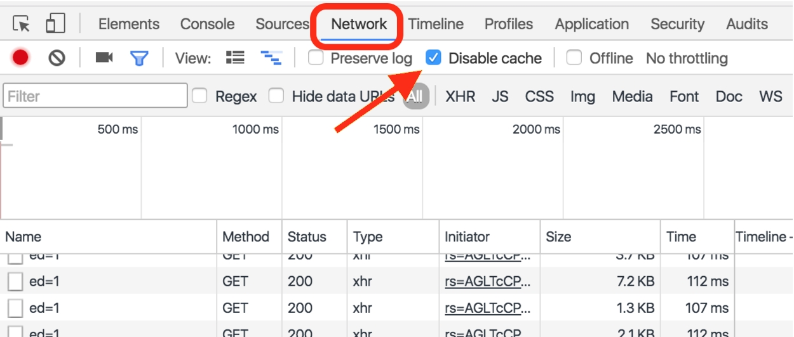

#### Firefox

[Open the **Toolbox**](#firefoxdevtools) and click the Settings icon to open the **Settings**. Under **Advanced settings**, select **Disable HTTP Cache**.

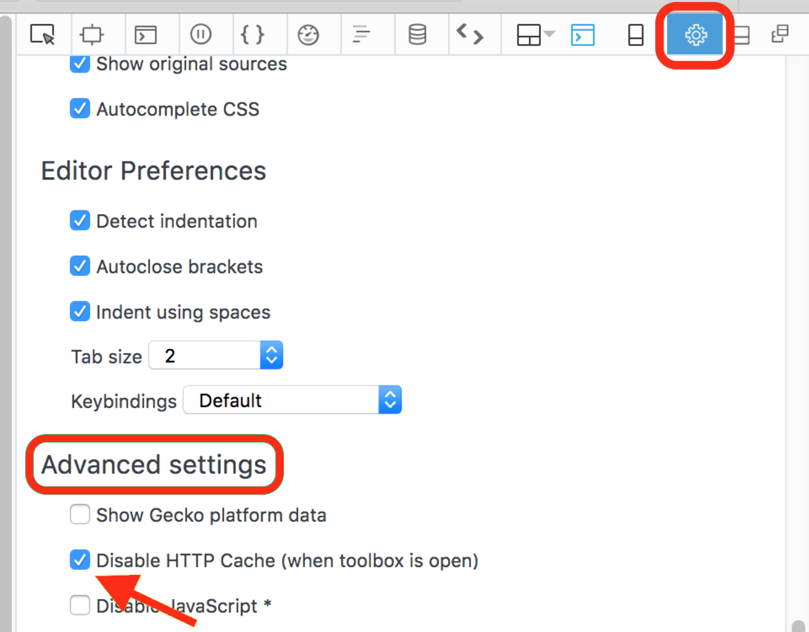

## Simulate mobile devices

Each browser has it's own version of device simulation and testing. See the documentation for each:

* [Chrome](/web/tools/chrome-devtools/device-mode/)
* [Firefox](https://developer.mozilla.org/en-US/docs/Tools/Responsive_Design_Mode#Device_selection)
* [Edge](https://docs.microsoft.com/en-us/microsoft-edge/f12-devtools-guide/emulation)
* [Safari](https://support.apple.com/kb/PH26266?locale=en_US&viewlocale=en_US)

These tools give you a close approximation as to how your site will look on a mobile device, but to get the full picture you should always test your site on real devices. Here is documentation for debugging Android devices on [Chrome](/web/tools/chrome-devtools/remote-debugging/) and [Firefox](https://developer.mozilla.org/en-US/docs/Tools/Remote_Debugging).

## Further reading

### Chrome

* [Debugging Progressive Web Apps](/web/tools/chrome-devtools/progressive-web-apps)

### Safari

* [Web Development Tools](https://developer.apple.com/safari/tools/)
* [Safari Web Inspector Guide](https://developer.apple.com/library/content/documentation/AppleApplications/Conceptual/Safari_Developer_Guide/GettingStarted/GettingStarted.html)

### Firefox

* [Opening Settings](https://developer.mozilla.org/en-US/docs/Tools/Settings)

### Opera

* [Opera Dragonfly documentation](http://www.opera.com/dragonfly/documentation/)

### Internet Explorer

* [Using the Debugger Console](https://msdn.microsoft.com/en-us/library/dd565628(v=vs.85).aspx#db_console)
* [Debugging Script with the Developer Tools](https://msdn.microsoft.com/en-us/library/dd565625(v=vs.85).aspx)
* [Using the Console to view errors and debug](https://msdn.microsoft.com/en-us/library/dn255006(v=vs.85).aspx)