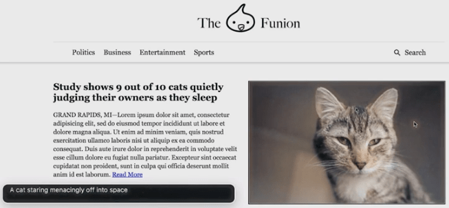

project_path: /web/fundamentals/_project.yaml book_path: /web/fundamentals/_book.yaml description: Using the alt attribute to provide text alternatives for images

{# wf_updated_on: 2018-09-20 #} {# wf_published_on: 2016-10-04 #} {# wf_blink_components: N/A #}

# Text Alternatives for Images {: .page-title }

  

Images are an important component of most web pages, and are of course a particular sticking point for low-vision users. We must consider the role an image plays in a page to work out what type of text alternative it should have. Take a look at this image.

    <article>
      <h2>Study shows 9 out of 10 cats quietly judging their owners as they sleep</h2>
      
    </article>
    

<article>
  <h2>Study shows 9 out of 10 cats quietly judging their owners as they sleep</h2>
  
</article>

In the page we have a picture of a cat, illustrating an article on cats' well-known judgmental behavior. A screen reader will announce this image using its literal name, `"/160204193356-01-cat-500.jpg"`. That's accurate, but not at all useful.

You can use the `alt` attribute to provide a useful text alternative to this image &mdash; for example, "A cat staring menacingly off into space."

    
    

Then the screen reader can announce a succinct description of the image ( seen in the black VoiceOver bar) and the user can choose whether to move on to the article.

A couple of comments about `alt`:

- `alt` allows you to specify a simple string to be used any time the image isn't available, such as when the image fails to load, or is accessed by web crawling bot, or is encountered by a screen reader.
- `alt` differs from `title`, or any type of caption, in that it is *only* used if the image is not available.

Writing useful alt text is a bit of an art. In order for a string to be a usable text alternative, it needs to convey the same concept as the image, in the same context.

Consider a linked logo image in the masthead of a page like those shown above. We can describe the image pretty accurately as "The Funion logo".

    
    

It might be tempting to give it a simpler text alternative of "home" or "main page", but that does a disservice to both low-vision and sighted users.

But imagine a screen reader user who wants to locate the masthead logo on the page; giving it an alt value of "home" actually creates a more confusing experience. And a sighted user faces the same challenge &mdash; figuring out what clicking the site logo does &mdash; as a screen reader user.

On the other hand, it's not always useful to describe an image. For example, consider a magnifying glass image inside a search button that has the text "Search". If the text wasn't there, you would definitely give that image an alt value of "search". But because we have the visible text, the screen reader will pick up and read aloud the word "search"; thus, an identical `alt` value on the image is redundant.

However, we know that if we leave the `alt` text out, we'll probably hear the image file name instead, which is both useless and potentially confusing. In this case you can just use an empty `alt` attribute, and the screen reader will skip the image altogether.

    
    

To summarize, all images should have an `alt` attribute, but they need not all have text. Important images should have descriptive alt text that succinctly describes what the image is, while decorative images should have empty alt attributes &mdash; that is, `alt=""`.

## Feedback {: #feedback }

