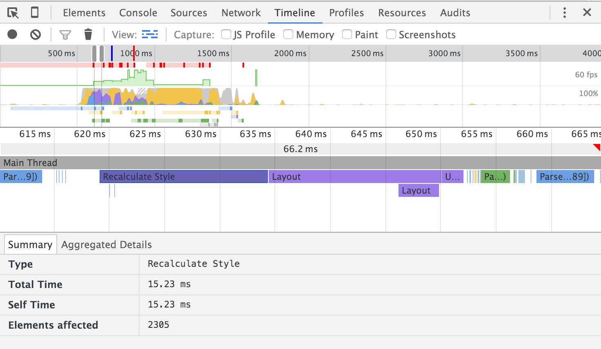
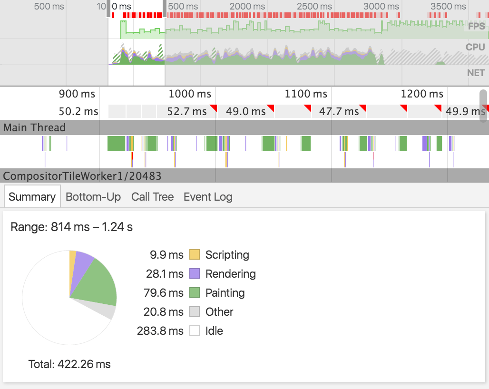

project_path: /web/tools/_project.yaml book_path: /web/tools/_book.yaml description: Users expect pages to be interactive and smooth. Each stage in the pixel pipeline represents an opportunity to introduce jank. Learn about tools and strategies to identify and fix common problems that slow down runtime performance.

{# wf_updated_on: 2018-07-27 #} {# wf_published_on: 2015-04-13 #} {# wf_blink_components: Platform>DevTools #}

# Analyze Runtime Performance {: .page-title }

 

Users expect pages to be interactive and smooth. Each stage in the pixel pipeline represents an opportunity to introduce jank. Learn about tools and strategies to identify and fix common problems that slow down runtime performance.

### TL;DR {: .hide-from-toc }

* Don't write JavaScript that forces the browser to recalculate layout. Separate read and write functions, and perform reads first.
* Don't over-complicate your CSS. Use less CSS and keep your CSS selectors simple.
* Avoid layout as much as possible. Choose CSS that doesn't trigger layout at all.
* Painting can take up more time than any other rendering activity. Watch out for paint bottlenecks.

## JavaScript

JavaScript calculations, especially ones that trigger extensive visual changes, can stall application performance. Don't let badly-timed or long-running JavaScript interfere with user interactions.

### Tools

Make a **Timeline** [recording](../evaluate-performance/timeline-tool#make-a-recording) and look for suspiciously long **Evaluate Script** events. If you find any, you can enable the [JS Profiler](../evaluate-performance/timeline-tool#profile-js) and re-do your recording to get more detailed information about exactly which JS functions were called and how long each took.

If you're noticing quite a bit of jank in your JavaScript, you may need to take your analysis to the next level and collect a JavaScript CPU profile. CPU profiles show where execution time is spent within your page's functions. Learn how to create CPU profiles in [Speed Up JavaScript Execution](js-execution).

### Problems

The following table describes some common JavaScript problems and potential solutions:

<table>
  <th>
    Problem
  </th>
  
  <th>
    Example
  </th>
  
  <th>
    Solution
  </th>
  
  <tr>
    <td data-th="Problem">
      Expensive input handlers affecting response or animation.
    </td>
    
    <td data-th="Example">
      Touch, parallax scrolling.
    </td>
    
    <td data-th="Solution">
      Let the browser handle touch and scrolls, or bind the listener as late as possible (see <a href="http://calendar.perfplanet.com/2013/the-runtime-performance-checklist/">Expensive Input Handlers in Paul Lewis' runtime performance checklist</a>).
    </td>
  </tr>
  
  <tr>
    <td data-th="Problem">
      Badly-timed JavaScript affecting response, animation, load.
    </td>
    
    <td data-th="Example">
      User scrolls right after page load, setTimeout / setInterval.
    </td>
    
    <td data-th="Solution">
      <a href="/web/fundamentals/performance/rendering/optimize-javascript-execution">Optimize JavaScript execution</a>: use <code>requestAnimationFrame</code>, spread DOM manipulation over frames, use Web Workers.
    </td>
  </tr>
  
  <tr>
    <td data-th="Problem">
      Long-running JavaScript affecting response.
    </td>
    
    <td data-th="Example">
      The <a href="https://developer.mozilla.org/en-US/docs/Web/API/Web_Workers_API/Using_web_workers">DOMContentLoaded event</a> stalls as it's swamped with JS work.
    </td>
    
    <td data-th="Solution">
      Move pure computational work to <a href="https://developer.mozilla.org/en-US/docs/Web/API/Web_Workers_API/Using_web_workers">Web Workers</a>. If you need DOM access, use <code>requestAnimationFrame</code> (see also <a href="/web/fundamentals/performance/rendering/optimize-javascript-execution">Optimize JavaScript Execution</a>).
    </td>
  </tr>
  
  <tr>
    <td data-th="Problem">
      Garbage-y scripts affecting response or animation.
    </td>
    
    <td data-th="Example">
      Garbage collection can happen anywhere.
    </td>
    
    <td data-th="Solution">
      Write less garbage-y scripts (see <a href="http://calendar.perfplanet.com/2013/the-runtime-performance-checklist/">Garbage Collection in Animation in Paul Lewis' runtime performance checklist</a>).
    </td>
  </tr>
</table>

## Style

Style changes are costly, especially if those changes affect more than one element in the DOM. Any time you apply styles to an element, the browser has to figure out the impact on all related elements, recalculate the layout, and repaint.

Related Guides:

* [Reduce the Scope and Complexity of Styles Calculations](/web/fundamentals/performance/rendering/reduce-the-scope-and-complexity-of-style-calculations)

### Tools

Make a **Timeline** [recording](../evaluate-performance/timeline-tool#make-a-recording). Check the recording for large **Recalculate Style** events (displayed in purple).

Click on a **Recalculate Style** event to view more information about it in the **Details** pane. If the style changes are taking a long time, that's a performance hit. If the style calculations are affecting a large number of elements, that's another area with room for improvement.

To reduce the impact of **Recalculate Style** events:

* Use the [CSS Triggers](https://csstriggers.com) to learn which CSS properties trigger layout, paint, and composite. These properties have the worst impact on rendering performance.
* Switch to properties that have less impact. See [Stick to compositor-only properties and manage layer count](/web/fundamentals/performance/rendering/stick-to-compositor-only-properties-and-manage-layer-count) for more guidance.

### Problems

The following table describes some common style problems and potential solutions:

<table>
  <th>
    Problem
  </th>
  
  <th>
    Example
  </th>
  
  <th>
    Solution
  </th>
  
  <tr>
    <td data-th="Problem">
      Expensive style calculations affecting response or animation.
    </td>
    
    <td data-th="Example">
      Any CSS property that changes an element's geometry, like its width, height, or position; the browser has to check all other elements and redo the layout.
    </td>
    
    <td data-th="Solution">
      <a href="/web/fundamentals/performance/rendering/avoid-large-complex-layouts-and-layout-thrashing">Avoid CSS that triggers layouts.</a>
    </td>
  </tr>
  
  <tr>
    <td data-th="Problem">
      Complex selectors affecting response or animation.
    </td>
    
    <td data-th="Example">
      Nested selectors force the browser to know everything about all the other elements, including parents and children.
    </td>
    
    <td data-th="Solution">
      <a href="/web/fundamentals/performance/rendering/reduce-the-scope-and-complexity-of-style-calculations">Reference an element in your CSS with just a class.</a>
    </td>
  </tr>
</table>

Related Guides:

* [Reduce the Scope and Complexity of Styles Calculations](/web/fundamentals/performance/rendering/reduce-the-scope-and-complexity-of-style-calculations)

## Layout

Layout (or reflow in Firefox) is the process by which the browser calculates the positions and sizes of all the elements on a page. The web’s layout model means that one element can affect others; for example, the width of the `<body>` element typically affects its children’s widths, and so on, all the way up and down the tree. The process can be quite involved for the browser.

As a general rule of thumb, if you ask for a geometric value back from the DOM before a frame is complete, you are going to find yourself with "forced synchronous layouts", which can be a big performance bottleneck if repeated frequently or performed for a large DOM tree.

Related Guides:

* [Avoid Layout Thrashing](/web/fundamentals/performance/rendering/avoid-large-complex-layouts-and-layout-thrashing)
* [Diagnose Forced Synchronous Layouts](/web/tools/chrome-devtools/rendering-tools/forced-synchronous-layouts)

### Tools

The Chrome DevTools **Timeline** identifies when a page causes forced synchronous layouts. These **Layout** events are marked with red bars.

"Layout thrashing" is a repetition of forced synchronous layout conditions. This occurs when JavaScript writes and reads from the DOM repeatedly, which forces the browser to recalculate the layout over and over. To identify layout thrashing, look for a pattern of multiple forced synchronous layout warnings (as in the screenshot above).

### Problems

The following table describes some common layout problems and potential solutions:

<table>
  <th>
    Problem
  </th>
  
  <th>
    Example
  </th>
  
  <th>
    Solution
  </th>
  
  <tr>
    <td data-th="Problem">
      Forced synchronous layout affecting response or animation.
    </td>
    
    <td data-th="Example">
      Forcing the browser to perform layout earlier in the pixel pipeline, resulting in repeating steps in the rendering process.
    </td>
    
    <td data-th="Solution">
      Batch your style reads first, then do any writes (see also <a href="/web/fundamentals/performance/rendering/avoid-large-complex-layouts-and-layout-thrashing">Avoid large, complex layouts and layout thrashing</a>).
    </td>
  </tr>
  
  <tr>
    <td data-th="Problem">
      Layout thrashing affecting response or animation.
    </td>
    
    <td data-th="Example">
      A loop that puts the browser into a read-write-read-write cycle, forcing the browser to recalculate layout over and over again.
    </td>
    
    <td data-th="Solution">
      Automatically batch read-write operations using <a href="https://github.com/wilsonpage/fastdom">FastDom library</a>.
    </td>
  </tr></tbody>
</table>

## Paint and composite

Paint is the process of filling in pixels. It is often the most costly part of the rendering process. If you've noticed that your page is janky in any way, it's likely that you have paint problems.

Compositing is where the painted parts of the page are put together for displaying on screen. For the most part, if you stick to compositor-only properties and avoid paint altogether, you should see a major improvement in performance, but you need to watch out for excessive layer counts (see also [Stick to compositor-only properties and manage layer count](/web/fundamentals/performance/rendering/stick-to-compositor-only-properties-and-manage-layer-count)).

### Tools

Want to know how long painting takes or how often painting occurs? Enable the [Paint profiler](../evaluate-performance/timeline-tool#profile-painting) on the **Timeline** panel and then [make a recording](../evaluate-performance/timeline-tool#make-a-recording). If most of your rendering time is spent painting, you have paint problems.

Check out the [**rendering settings**](../evaluate-performance/timeline-tool#rendering-settings) menu for further configurations that can help diagnose paint problems.

### Problems

The following table describes some common paint and composite problems and potential solutions:

<table>
  <th>
    Problem
  </th>
  
  <th>
    Example
  </th>
  
  <th>
    Solution
  </th>
  
  <tr>
    <td data-th="Problem">
      Paint storms affecting response or animation.
    </td>
    
    <td data-th="Example">
      Big paint areas or expensive paints affecting response or animation.
    </td>
    
    <td data-th="Solution">
      Avoid paint, promote elements that are moving to their own layer, use transforms and opacity (see <a href="/web/fundamentals/performance/rendering/simplify-paint-complexity-and-reduce-paint-areas">Simplify paint complexity and reduce paint areas</a>).
    </td>
  </tr>
  
  <tr>
    <td data-th="Problem">
      Layer explosions affecting animations.
    </td>
    
    <td data-th="Example">
      Overpromotion of too many elements with translateZ(0) greatly affects animation performance.
    </td>
    
    <td data-th="Solution">
      Promote to layers sparingly, and only when you know it offers tangible improvements (see <a href="/web/fundamentals/performance/rendering/stick-to-compositor-only-properties-and-manage-layer-count">Stick to composite-only properties and manage layer count</a>).
    </td>
  </tr>
</table>

## Feedback {: #feedback }

