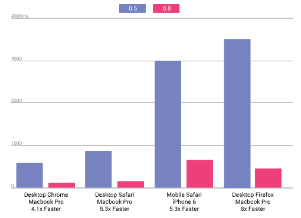

project_path: /web/_project.yaml book_path: /web/shows/_book.yaml description: Microsoft shows off Project Spartan, Beacons by Blesh connect the physical world to your phone, React Native goes open source, a11y-wins.tumblr.com catalogs great accessibility, Polymer 0.8 hits the airwaves, and preload links get an intent to implemnt

{# wf_updated_on: 2017-07-25 #} {# wf_published_on: 2015-04-14 #} {# wf_youtube_id: REAnmF5FHUA #}

# The physical web is all around us {: .page-title }

  <iframe class="devsite-embedded-youtube-video" data-video-id="REAnmF5FHUA"
          data-autohide="1" data-showinfo="0" frameborder="0" allowfullscreen>
  </iframe>

## In this Weeks Episode

Microsoft shows off Project Spartan, Beacons by Blesh connect the physical world to your phone, React Native goes open source, a11y-wins.tumblr.com catalogs great accessibility, Polymer 0.8 hits the airwaves, and preload links get an intent to implemnt

### React Native 0:13

React Native is an open source framework which allows you to run your react app on native iOS. It comes with a bundle of components and you can grab additional add-ons at [react.parts/native-ios](http://react.parts/native-ios).

Learn more in [this video from React.js Conf](https://youtu.be/KVZ-P-ZI6W4).

### A11y-Wins 0:31

It's hard to find good examples of accessibility websites. To help solve this problem Marcy Sutton has created [a11ywins.tumblr.com](http://a11ywins.tumblr.com/) which covers sites which are doing accessibility right.

Learn more on accessibility by [watching Marcy Sutton's talk from Smashing Conf](https://vimeo.com/118697675).

### Polymer 0.8 0:48

Polymer 0.8 is out in the open and showing great performance boosts with 5x improvement on mobile safari and 8x improvement on desktop Firefox.

Checkout the [blog post on the release here](https://www.polymer-project.org/0.8/) and [learn more in this Polycast](/web/shows/polycasts/season-2/first-look-polymer-0.8).

### Preload Links 1:05

Downloading resources can be a major bottleneck and preload links are a new way to give the browser prioritization over what assets to download ahead of time.

With this [intent to implement](https://groups.google.com/a/chromium.org/forum/#!msg/blink-dev/Abrd-tbDyuQ/4YP6_yvBa94J), signals are good that it'll be coming to Chrome.

### Project Spartan 1:21

Project Spartan is Microsoft's new browser built to be lean, mean and standards compliant. [The Verge](http://www.theverge.com/2015/3/31/8319169/project-spartan-new-browser-microsoft-hands-on) took for a test drive and you can [learn more from either](https://www.youtube.com/watch?v=KKjkfkAmzAg) of [these videos from Microsoft](https://www.youtube.com/watch?v=4A5ZXWTIlHw).

Still want more? Then no worries, you can check out the [Technical Preview of Spartan here](http://blogs.msdn.com/b/ie/archive/2015/03/30/quot-project-spartan-quot-in-the-windows-technical-preview-build-10049.aspx).

### Physical Web Beacons 1:42

The [Physical Web](https://google.github.io/physical-web/) was a project started at Google which uses beacons to transmit signals which are picked up by mobile devices to know what is around them.

Blesh have just released a demo of [their physical web beacons which you can watch here](https://www.youtube.com/watch?v=8AryiXsPQ1Y).