project_path: /web/tools/_project.yaml book_path: /web/tools/_book.yaml description: Learn how to save changes made within DevTools to disk.

{# wf_blink_components: Platform>DevTools #} {# wf_updated_on: 2018-12-14 #} {# wf_published_on: 2018-04-10 #}

{# Links #}

# Edit Files With Workspaces {: .page-title }



<aside class="objective">
  <b>Goal</b>: This tutorial provides hands-on practice in setting up and using Workspaces so
  that you can use Workspaces in your own projects. Workspaces enable you to save changes that
  you make within DevTools to source code that's stored on your computer.
</aside>

<aside class="caution">
  <b>Prerequisites</b>: Before beginning this tutorial, you should know how to:
  <ul>
    <li>
      <a href="https://developer.mozilla.org/en-US/docs/Learn/Getting_started_with_the_web"
      class="external">Use HTML, CSS, and JavaScript to build a web page</a>.
    </li>
    <li>
      <a href="/web/tools/chrome-devtools/css/">Use DevTools to make basic changes
      to CSS</a>.
    </li>
    <li>
      <a href="https://developer.mozilla.org/en-US/docs/Learn/Common_questions/set_up_a_local_testing_server#Running_a_simple_local_HTTP_server"
         class="external">Run a local HTTP web server</a>.
    </li>
  </ul>
</aside>

## Overview {: #overview }

Workspaces enable you to save a change that you make in Devtools to a local copy of the same file on your computer. For example, suppose:

* You have the source code for your site on your desktop.
* You're running a local web server from the source code directory, so that the site is accessible at `localhost:8080`.
* You've got `localhost:8080` open in Google Chrome, and you're using DevTools to change the site's CSS.

With Workspaces enabled, the CSS changes that you make within DevTools are saved to the source code on your desktop.

## Limitations {: #limitations }

If you're using a modern framework, it probably transforms your source code from a format that's easy for you to maintain into a format that's optimized to run as quickly as possible. Workspaces is usually able to map the optimized code back to your original source code with the help of [source maps](http://blog.teamtreehouse.com/introduction-source-maps){:.external}. But there's a lot of variation between frameworks over how they use source maps. Devtools simply can't support all the variations.

Workspaces is known to not work with these frameworks:

* Create React App

If you run into issues while using Workspaces with your framework of choice, or you get it working after some custom configuration, please [start a thread in the mailing list](https://groups.google.com/forum/#!forum/google-chrome-developer-tools){:.external} or [ask a question on Stack Overflow](https://stackoverflow.com/questions/ask?tags=google-chrome-devtools){:.external} to share your knowledge with the rest of the DevTools community.

## Related feature: Local Overrides {: #overrides }

[Local Overrides](/web/updates/2018/01/devtools#overrides) is another DevTools feature that is similar to Workspaces. Use Local Overrides when you want to experiment with changes to a page, and you need to see those changes across page loads, but you don't care about mapping your changes to the page's source code.

## Step 1: Setup {: #setup }

Complete this tutorial to get hands-on experience with Workspaces.

### Set up the demo {: #demo }

1. <a href="https://glitch.com/edit/#!/remix/workspaces" class="external gc-analytics-event"
data-category="DevTools" data-label="Workspaces / Opened Demo" data-value="1">Open the demo</a>. In the top-left of the editor, there's a randomly-generated project name.
    
    <figure> 
    
    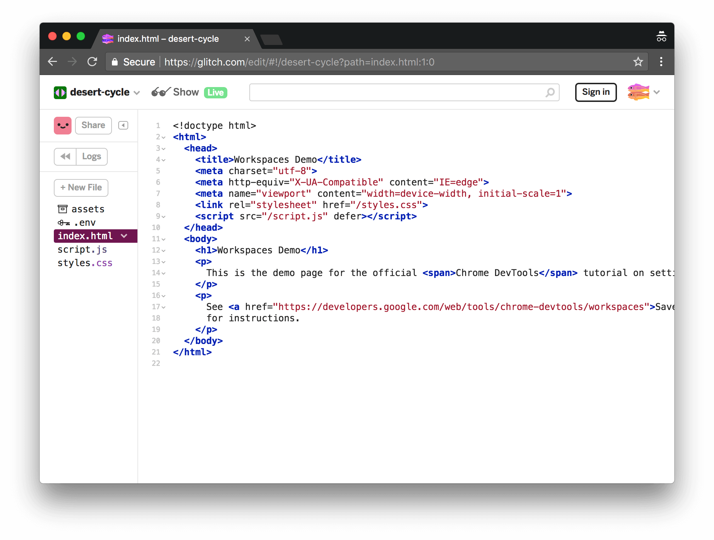 <figcaption> **Figure 1**. A Glitch project with a randomly-generated name </figcaption> </figure>
2. Click the randomly-generated project name. For example, in **Figure 1** you would click **desert-cycle**.

3. Select **Advanced Options** > **Download Project**.
    
    <figure> 
    
    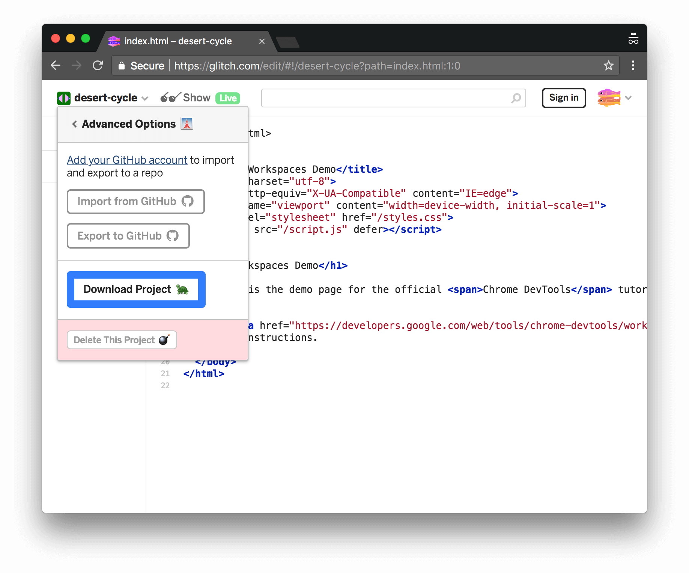 <figcaption> **Figure 2**. The **Download Project** button, highlighted in blue </figcaption> </figure>
4. Close the tab.

5. Unzip the source code and move the unzipped `app` directory to your desktop. For the rest of this tutorial this directory will be referred to as `~/Desktop/app`.
6. Start a local web server in `~/Desktop/app`. Below is some sample code for starting up `SimpleHTTPServer`, but you can use whatever server you prefer.
    
    <pre class="prettyprint"><code class="devsite-terminal">cd ~/Desktop/app</code>
<code class="devsite-terminal">python -m SimpleHTTPServer</code>
</pre>
7. Open a tab in Google Chrome and go to locally-hosted version of the site. You should be able to access it via a URL like `localhost:8080`. The exact [port number](https://en.wikipedia.org/wiki/Port_(computer_networking)#Use_in_URLs){:.external} may be different.
    
    <figure> 
    
    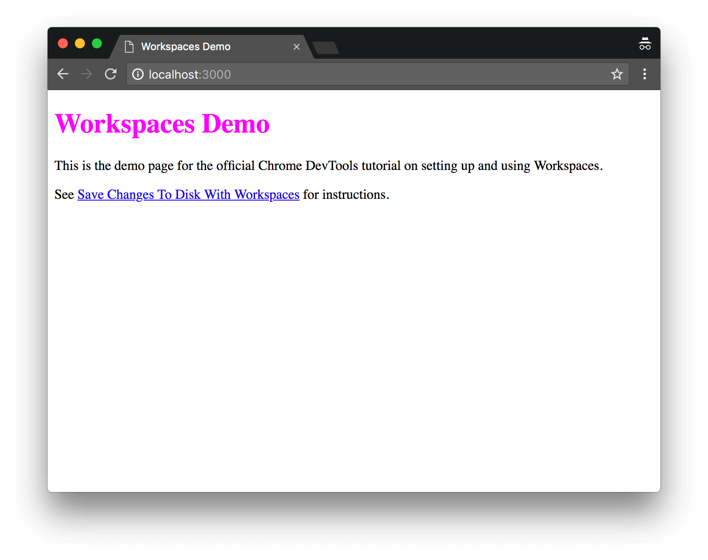 <figcaption> **Figure 3**. The demo </figcaption> </figure>

### Set up DevTools {: #devtools }

1. Press <kbd>Command</kbd>+<kbd>Option</kbd>+<kbd>J</kbd> (Mac) or <kbd>Control</kbd>+<kbd>Shift</kbd>+<kbd>J</kbd> (Windows, Linux, Chrome OS) to open the **Console** panel of DevTools.
    
    <figure> 
    
    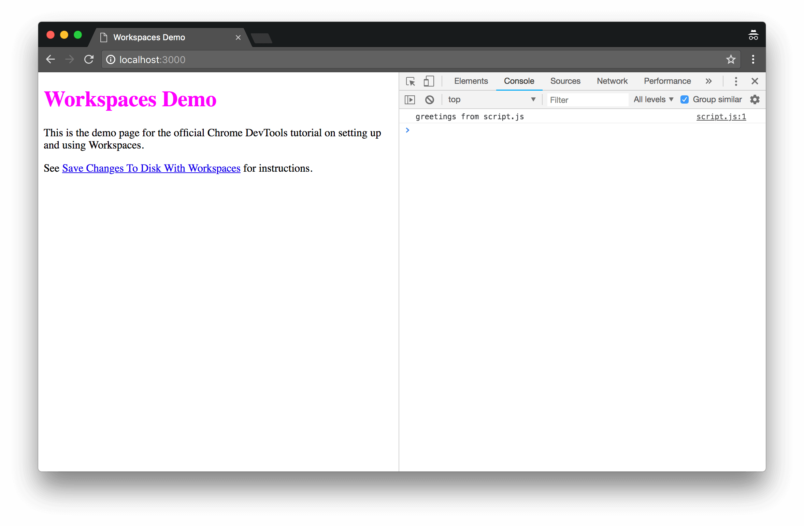 <figcaption> **Figure 4**. The **Console** panel </figcaption> </figure>
2. Click the **Sources** tab.

3. Click the **Filesystem** tab.
    
    <figure> 
    
    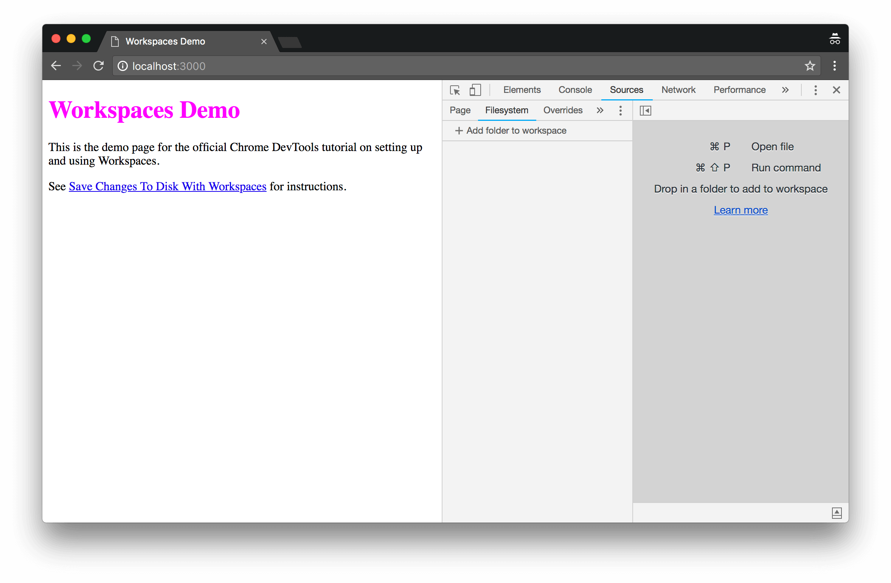 <figcaption> **Figure 5**. The **Filesystem** tab </figcaption> </figure>
4. Click **Add Folder To Workspace**.

5. Select `~/Desktop/app`.
6. Click **Allow** to give DevTools permission to read and write to the directory. In the **Filesystem** tab, there is now a green dot next to `index.html`, `script.js`, and `styles.css`. These green dots mean that DevTools has established a mapping between the network resources of the page, and the files in `~/Desktop/app`.
    
    <figure> 
    
     <figcaption> **Figure 6**. The **Filesystem** tab now shows a mapping between the local files and the network ones </figcaption> </figure>

## Step 2: Save a CSS change to disk {: #css }

1. Open `~/Desktop/app/styles.css` in a text editor. Notice how the `color` property of `h1` elements is set to `fuchsia`.
    
    <figure> 
    
    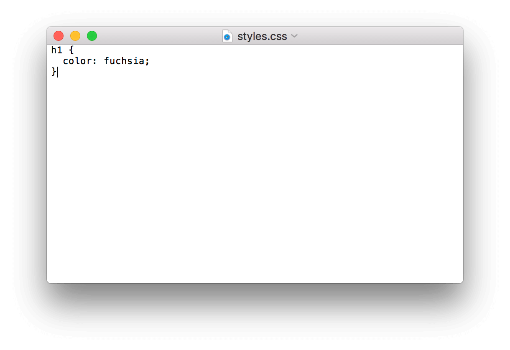 <figcaption> **Figure 7**. Viewing `styles.css` in a text editor </figcaption> </figure>
2. Close the text editor.

3. Back in DevTools, click the **Elements** tab.
4. Change the value of the `color` property of the `<h1>` element to your favorite color. Remember that you need to click the `<h1>` element in the **DOM Tree** in order to see the CSS rules applied to it in the **Styles** pane. The green dot next to `styles.css:1` means that any change you make will get mapped to `~/Desktop/app/styles.css`.
    
    <figure> 
    
    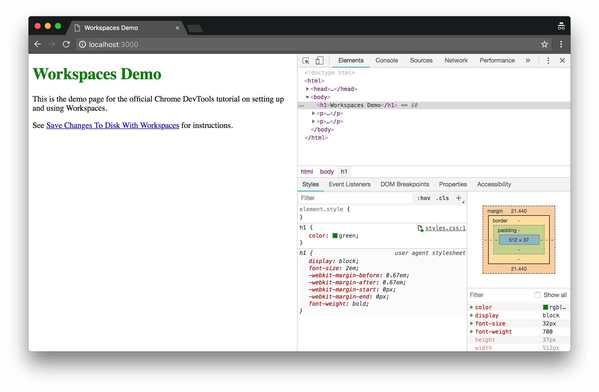 <figcaption> **Figure 8**. Setting the `color` property of the `h1` element to `green` </figcaption> </figure>
5. Open `~/Desktop/app/styles.css` in a text editor again. The `color` property is now set to your favorite color.

6. Reload the page. The color of the `<h1>` element is still set to your favorite color. This works because when you made the change, DevTools saved the change to disk. And then, when you reloaded the page, your local server served the modified copy of the file from disk.

## Step 3: Save an HTML change to disk {: #html }

### Try changing HTML from the Elements panel {: #elements }

Warning: The workflow that you're about to try doesn't work. You're trying it now so that you don't waste time later trying to figure out why it's not working.

1. Click the **Elements** tab.
2. Double click the text content of the `h1` element, which says `Workspaces Demo`, and replace it with `I ❤️  Cake`.
    
    <figure> 
    
    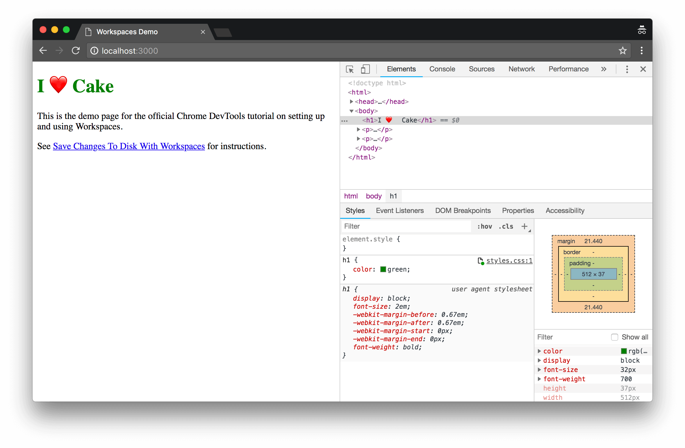 <figcaption> **Figure 9**. Attempting to change HTML from the **DOM Tree** of the **Elements** panel </figcaption> </figure>
3. Open `~/Desktop/app/index.html` in a text editor. The change that you just made isn't there.

4. Reload the page. The page reverts to its original title.

#### Optional: Why it doesn't work {: #why }

Note: This section describes why the workflow from [Try changing HTML from the Elements panel](#elements) doesn't work. You can skip this section if you don't care why.

* The tree of nodes that you see on the **Elements** panel represents the page's [DOM](https://developer.mozilla.org/en-US/docs/Web/API/Document_Object_Model/Introduction){:.external}.
* To display a page, a browser fetches HTML over the network, parses the HTML, and then converts it into a tree of DOM nodes.
* If the page has any JavaScript, that JavaScript may add, delete, or change DOM nodes. CSS can change the DOM, too, via the [`content`](https://developer.mozilla.org/en-US/docs/Web/CSS/content){:.external} property.
* The browser eventually uses the DOM to determine what content it should present to browser users.
* Therefore, the final state of the page that users see may be very different from the HTML that the browser fetched.
* This makes it difficult for DevTools to resolve where a change made in the **Elements** panel should be saved, because the DOM is affected by HTML, JavaScript, and CSS.

In short, the **DOM Tree** `!==` HTML.

### Change HTML from the Sources panel {: #sources }

If you want to save a change to the page's HTML, do it via the **Sources** panel.

1. Click the **Sources** tab.
2. Click the **Page** tab.
3. Click **(index)**. The HTML for the page opens.
4. Replace `<h1>Workspaces Demo</h1>` with `<h1>I ❤️  Cake</h1>`. See **Figure 11**.
5. Press <kbd>Command</kbd>+<kbd>S</kbd> (Mac) or <kbd>Control</kbd>+<kbd>S</kbd> (Windows, Linux, Chrome OS) to save the change.
6. Reload the page. The `<h1>` element is still displaying the new text.
    
    <figure> 
    
    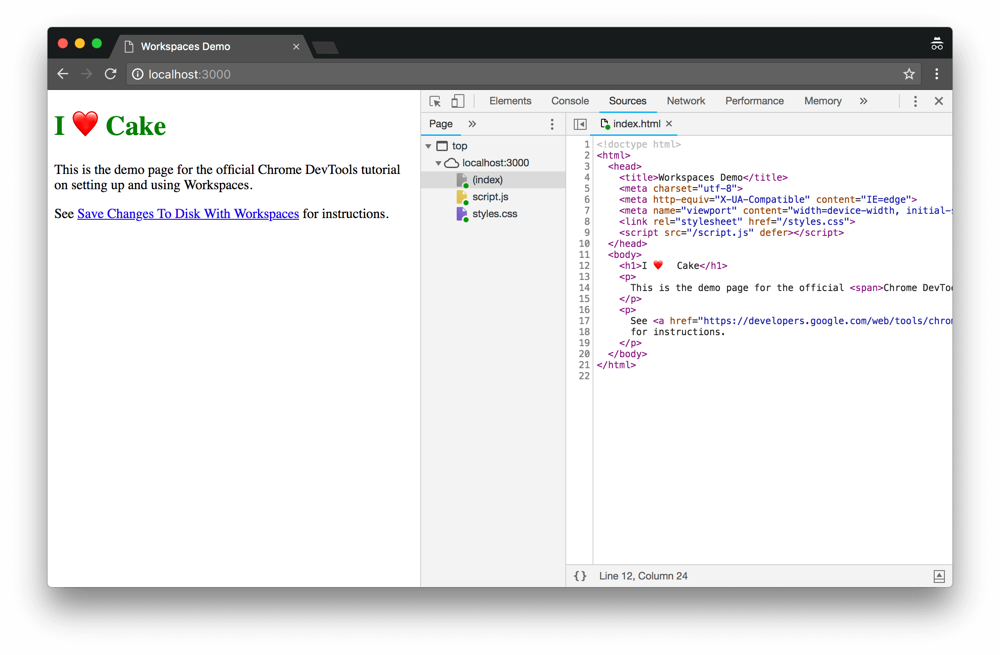 <figcaption> **Figure 11**. Line 12 has been set to `I ❤️  Cake` </figcaption> </figure>
7. Open `~/Desktop/app/index.html`. The `<h1>` element contains the new text.

## Step 4: Save a JavaScript change to disk {: #js }

The **Sources** panel is also the place to make changes to JavaScript. But sometimes you need to access other panels, such as the **Elements** panel or the **Console** panel, while making changes to your site. There's a way to have the **Sources** panel open alongside other panels.

1. Click the **Elements** tab.
2. Press <kbd>Command</kbd>+<kbd>Shift</kbd>+<kbd>P</kbd> (Mac) or <kbd>Control</kbd>+<kbd>Shift</kbd>+<kbd>P</kbd> (Windows, Linux, Chrome OS). The **Command Menu** opens.
3. Type `QS`, then select **Show Quick Source**. At the bottom of your DevTools window there is now a **Quick Source** tab. The tab is displaying the contents of `index.html`, which is the last file you edited in the **Sources** panel. The **Quick Source** tab gives you the editor from the **Sources** panel, so that you can edit files while having other panels open.
    
    <figure> 
    
    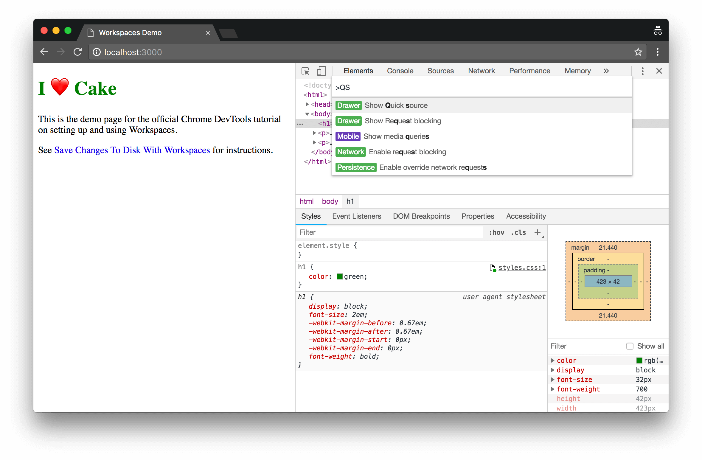 <figcaption> **Figure 12**. Opening the **Quick Source** tab via the **Command Menu** </figcaption> </figure>
4. Press <kbd>Command</kbd>+<kbd>P</kbd> (Mac) or <kbd>Control</kbd>+<kbd>P</kbd> (Windows, Linux, Chrome OS) to open the **Open File** dialog. See **Figure 13**.

5. Type `script`, then select **app/script.js**.
    
    <figure> 
    
    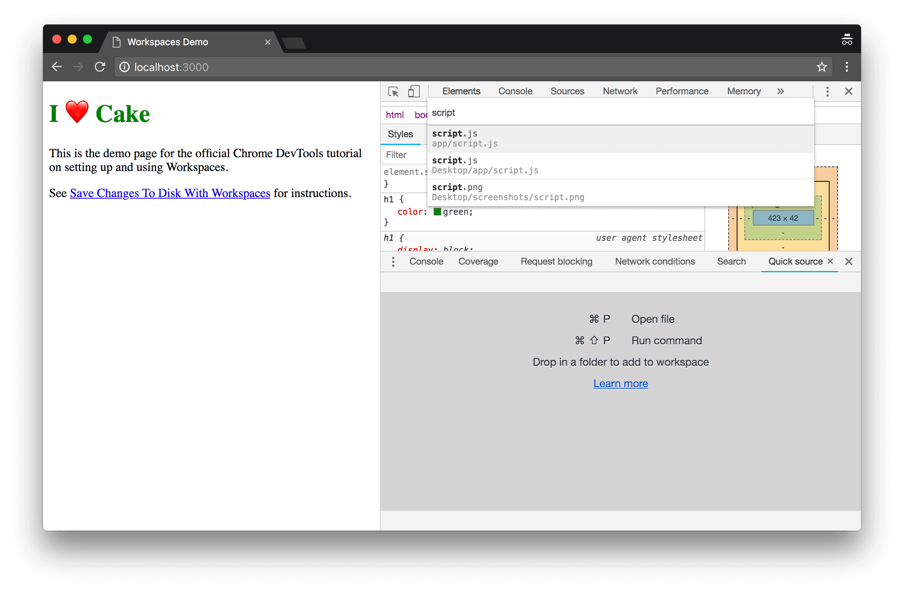 <figcaption> **Figure 13**. Opening `script.js` via the **Open File** dialog </figcaption> </figure>
6. Notice the `Save Changes To Disk With Workspaces` link in the demo. It's styled regularly.

7. Add the following code to the bottom of **script.js** via the **Quick Source** tab.
    
    <pre class="prettyprint">console.log('greetings from script.js');
<strong>document.querySelector('a').style = 'font-style:italic';</strong>
</pre>
8. Press <kbd>Command</kbd>+<kbd>S</kbd> (Mac) or <kbd>Control</kbd>+<kbd>S</kbd> (Windows, Linux, Chrome OS) to save the change.

9. Reload the page. The link on the page is now italic.
    
    <figure> 
    
    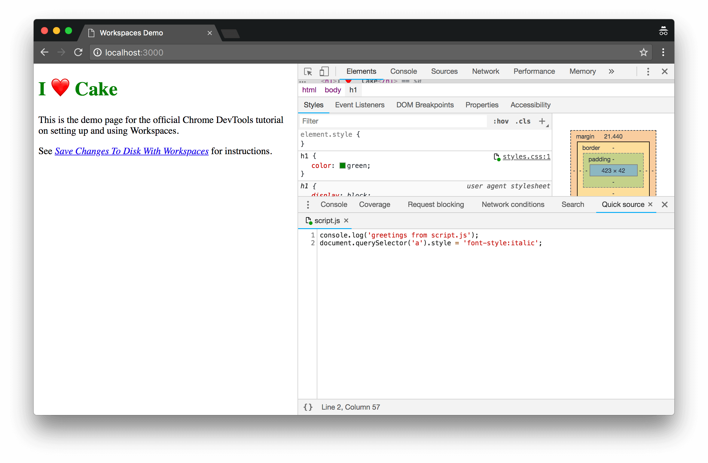 <figcaption> **Figure 14**. The link on the page is now italic </figcaption> </figure>

## Next steps {: #next-steps }

Congratulations, you have completed the tutorial. Click the button below to receive your prize.

 

 

 

 

Use what you have learned in this tutorial to set up Workspaces in your own project. If you run into any issues or are able to get it working after some custom configuration, please [start a thread in the mailing list](https://groups.google.com/forum/#!forum/google-chrome-developer-tools){:.external} or [ask a question on Stack Overflow](https://stackoverflow.com/questions/ask?tags=google-chrome-devtools){:.external} to share your knowledge with the rest of the DevTools community.

## Feedback {: #feedback }



If you'd like to give more feedback on these topics or anything else, please use any of the channels below:

* [Mailing List](https://groups.google.com/forum/#!forum/google-chrome-developer-tools){:.external}
* [Twitter](https://twitter.com/chromedevtools){:.external}