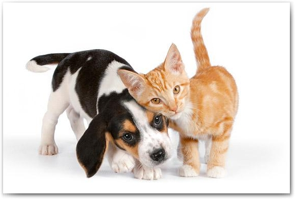
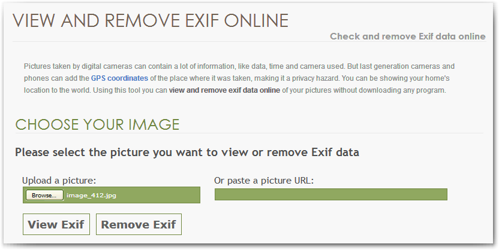
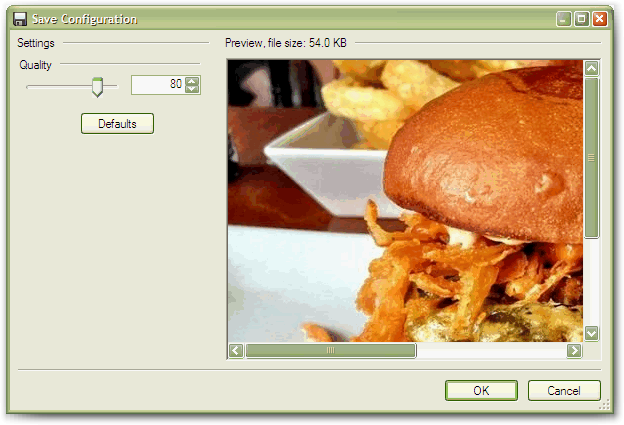
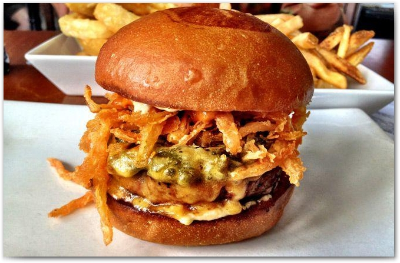

project_path: /web/fundamentals/_project.yaml book_path: /web/fundamentals/_book.yaml

{# wf_updated_on: 2018-08-17 #} {# wf_published_on: 2018-02-22 #} {# wf_blink_components: Blink>Image #}

# Graphical Content {: .page-title }



Web users are a visual bunch, and we rely on images to support web content. Like text, graphical content is a critical component in conveying information in a web page or app. All kinds of images, from charts and graphs to icons and arrows to mugshots and maps, provide instantaneous data and improve reader comprehension and retention. But, unlike text, images require considerable time and bandwidth to download and render. Graphical content can easily account for 60%-85% of a typical website's total bandwidth (source: it depends on who you ask). [HTTPArchive](http://httparchive.org/interesting.php), for example, notes that images account for approximately 50% of the average web site's content.

Clearly, one of the major ways to get a significant performance boost is to reduce the amount of time images take to load. Let's examine some ways to tackle this problem.

## Remove Unnecessary Images

The first question to ask is whether you really need an image, and it's a question that apparently isn't asked enough. Far too many sites of all kinds put large, and mostly useless, images "above the fold". This slows down the page load and makes readers scroll halfway down the page before they get to meaningful content.

Consider whether each image is really needed and, if so, whether it is needed right away. Can it be loaded later, after more critical content? If not, can it be optimized so that it has the least effect on the page load? Remember that the time required to download content &mdash; particularly graphical content &mdash; should be time well spent in exchange for information provided by the image.

Yes, images can genuinely support text content or can just lend visual interest, but if an image doesn't add informational value or clarify meaning for the user, remove it. The fastest image is one you don't have to download; every image you remove speeds up your page load time.

## Choose Appropriate Image Types

As a rule of thumb, use PNGs for clip art, line drawings, or wherever you need transparency, JPGs for photographs, and GIFs when you need animation. When in doubt, do a simple but definitive test: save an image in multiple formats and compare!

It's frequently supposed that PNGs (a [lossless compression](https://en.wikipedia.org/wiki/Lossless_compression) format) yield a visual advantage over JPGs (a [lossy compression](https://en.wikipedia.org/wiki/Lossy_compression) format) for photographic images, but this is often not the case. For example, the two images below both look great; there is no obvious visual difference between them. The animals' eyes are clear, the fur is distinct, and the shadows are smooth.

 *dog+cat.png -- 232k*

 *dog+cat.jpg -- 42k*

But the PNG image is 232k, while the JPG is just 42k! That's an 81% improvement in download time with no visible loss in quality. Verdict: JPG FTW.

## Remove Image Metadata

Metadata, or "data about data", exists in most images and may include (on a camera photo, for example) data about the camera/phone model, a date and time stamp, photo app settings, file format, height and width, geolocation coordinates, and more. An image editor might include metadata in its saved files such as author name, resolution, color space, copyright, and keywords.

For most website images, metadata is unimportant, so we would be wise to strip it out. As you've surely guessed, there are many ways to do this. First, have a look at your preferred image editor; it might already have the capability to view and edit metadata. (Gimp does, for example.) If not, just use one of the tools available online, such as VerExif: <http://www.verexif.com/en/>.

For example, this JPG picture (originally 1280 x 720, resized for presentation here) was taken with a mobile phone camera in Australia in 2015.

 *bonniedoon.jpg, original, 363k*

VerExif's online tool was used to upload the image and identify the metadata for removal.

 *VerExif's upload dialog*

This image had quite a bit (38k!) of metadata, as you can see in the table below. (Note that the geolocation data is empty, possibly because the US-based phone had no service at that location.)

<table>
  <tr>
    <th>Metadata Type</th>
    <th>Metadata Value</th>
  </tr>
  <tr>
    <td>Camera make</td>
    <td>SAMSUNG</td>
  </tr>
  <tr>
    <td>Camera model</td>
    <td>SCH-1535</td>
  </tr>
  <tr>
    <td>Date/Time</td>
    <td>2015/10/25 12:07:24</td>
  </tr>
  <tr>
    <td>Resolution</td>
    <td>1280 x 720</td>
  </tr>
  <tr>
    <td>Flash used</td>
    <td>No</td>
  </tr>
  <tr>
    <td>Focal length</td>
    <td>3.7mm</td>
  </tr>
  <tr>
    <td>Exposure time</td>
    <td>0.0024 s (1/420)</td>
  </tr>
  <tr>
    <td>Aperture</td>
    <td>f/2.6</td>
  </tr>
  <tr>
    <td>ISO equiv.</td>
    <td>80</td>
  </tr>
  <tr>
    <td>Whitebalance</td>
    <td>Auto</td>
  </tr>
  <tr>
    <td>Metering Mode</td>
    <td>average</td>
  </tr>
  <tr>
    <td>Exposure</td>
    <td>aperture priority (semi-auto)</td>
  </tr>
  <tr>
    <td>GPS Latitude</td>
    <td>? ?o ' "</td>
  </tr>
  <tr>
    <td>GPS Longitude</td>
    <td>? ?o ' "</td>
  </tr>
</table>

After the metadata was removed, the file size went down from 363k to 325k, a difference of 10.5%; certainly not as dramatic as physical size reduction or compression, but ten percent is nothing to sneeze at, especially if you have multiple photographs.

Metadata removal tools are plentiful, and there's a good article about the whys and hows of Exif removal at MakeUseOf.

<http://www.makeuseof.com/tag/3-ways-to-remove-exif-metadata-from-photos-and-why-you-might-want-to/>

## Resize Images

### Size images based on their intended use

Large images take longer to download than smaller ones. All your images should be appropriately sized for their intended use and should not rely on the browser to resize them for rendering.

Often, large images are retrieved from the server and then resized in the browser with CSS. This might be for a perfectly logical reason -- such as using just one image for a thumbnail that expands on hover -- or it might just be careless coding. Whatever the reason, it wastes bandwidth.

For example, you might have a 1200 x 600 pixel image that you present at 60 x 30 (as a 5% thumbnail) and roll it up to full size on hover using a CSS transition. It works fine and looks great, but if the user never actually hovers over the thumbnail, then 95% of the time that image took to download was wasted. You may be better off taking the time to make separate, properly sized thumbnails, displaying the full sized images only if they're actually requested.

### Crop images to show only what's important

One enormously effective technique to reduce file size for images of all kinds is simple cropping: omitting parts of the image that aren't important to information delivery.

Extra background and whitespace, unnecessary borders, and unintended objects clutter an image not just visually but physically, affecting the image size and its download efficiency.

The photo of the Australia traveler shown above is, frankly, too large, both horizontally and vertically. It could be cropped to more effectively focus on the person, the sign on the fence, and the main part of the house.

 *bonniedoon.jpg, cropped, 115k*

Here, we started with the already-resized version starting at 220k, then cropped it, saving it to the version seen above at 115k. That's a 52% reduction, and the photo now focuses on the important parts (yes, the doghouse is important!) at half the file size. All the required information is there, it's just more efficiently presented.

### Reduce image quality

Of course, we want our images to look as good as possible, within reason, so that means saving JPGs at 100% quality, right? Not necessarily. In most (which is to say nearly all) cases, you can reduce the JPG quality, and thus the file size, without suffering any visible quality difference.

Once you've determined the size that an image should really be, how do you get it to that size but still retain the quality and characteristics it needs? The first thing you need is a good image manipulation tool. For these modifications we used the popular Windows desktop product [paint.net](https://www.getpaint.net).

Have a look at the following photograph-type JPGs, where the quality is progressively reduced, and note the decreasing file sizes. A quick calculation reveals that the size difference between the 100% quality image and the 25% quality image is 90%! But can you actually see the difference? Perhaps more importantly, even if you *can* see any difference, is it significant enough to warrant a larger file and thus a slower download?

 *burger100.jpg -- The original image at 100%, 227k*

 *Using paint.net to save at lower quality*

 *burger80.jpg -- 80%, 60k*

 *burger50.jpg -- 50%, 34k*

 *burger25.jpg -- 25%, 20k*

The takeaway is obvious: definitely experiment with lower-quality JPGs to see how low you can go before seeing a difference, and then use the smallest one that retains the photo's clarity. What is not so obvious is that file size can be a seductively simple fix that is not without its downsides. Again, some experimentation is warranted before settling on quality reduction as a catch-all solution. For more detailed information, see this excellent article, [How to Compare Images Fairly](https://kornel.ski/en/faircomparison).

Additional image manipulation tools:

- [XNConvert](https://www.xnview.com/en/xnconvert/): This free, cross-platform tool can handle batched images, and performs resizing, optimization, and other transforms.
- [ImageOptim](https://imageoptim.com/mac): This free tool is available for Mac and as an online service, and is specifically aimed at optimizing images for speed, including metadata removal (discussed above).
- [ResizeIt](https://itunes.apple.com/us/app/resizeit/id416280139?mt=12): A Mac-only desktop product that lets you change the size of multiple images simultaneously, and can convert file formats at the same time.
- [PicResize](http://www.picresize.com/): One of several good browser-based tools that gives you lots of options for cropping, rotating, resizing, adding effects to, and converting images.
- [Gimp](https://www.gimp.org/): This ever-popular cross-platform tool just gets better with age. Powerful and flexible, Gimp lets you perform a wide variety of image manipulation tasks including, of course, resizing.

This is just a smattering of available tools. We aren't here for a comparative review of image editors, although CrazyEgg has a comprehensive article here:

<https://www.crazyegg.com/blog/image-editing-tools/>

## Compress Images

PNG and JPG images can be squashed down even more using a compression tool, which reduces file size without affecting either image dimensions or visual quality. For example, here is an image compression done with TinyPng, a free online compression tool.

<https://tinypng.com/>

You can see the huge compression result for the image `resizeitscreenshot.png` in the screenshot below (TinyPng uploads but doesn't display the image it is compressing). TinyPng reports that the image size went down from 551k to 133k, a 76% improvement.

 *TinyPng*

And yes, TinyPng was used on that TinyPng screenshot itself, saving 57%.

Don't assume that because PNGs are lossless they can't be squashed down even further; they can. And TinyPng is of course not the only tool available. Here's a great rundown on a bunch of image compression products.

<http://enviragallery.com/9-best-free-image-optimization-tools-for-image-compression/>

## Summary

While the techniques in this section are not all-inclusive, they represent a good set of processes you can use to reduce your image sizes, and thus their transmission speed. Graphical content size is a major area that is easy to address but that can give your site a significant speed boost in your quest for faster-loading pages.

You can find an excellent in-depth article about image optimization here:

[https://developers.google.com/web/fundamentals/performance/optimizing-content-efficiency/image-optimization](http://tinyurl.com/pmy5d9f)

And see the [Wrap-up and Demo](/web/fundamentals/performance/get-started/wrapup-7) page for direct application of these and other techniques discussed in this set of articles.

## Feedback {: #feedback }

