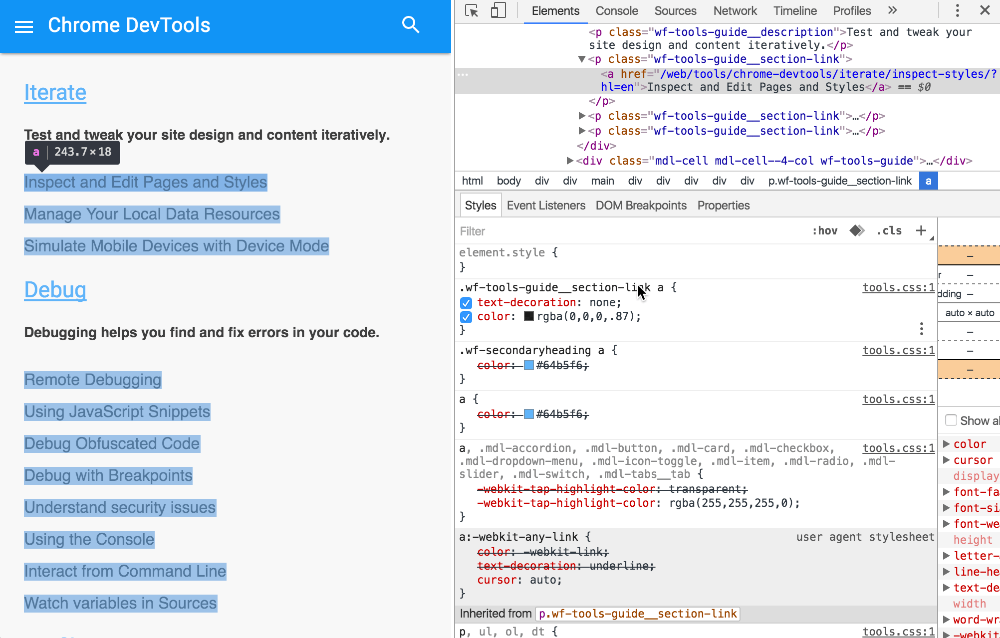
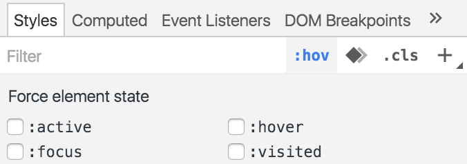
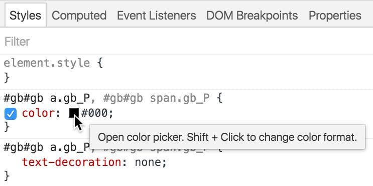
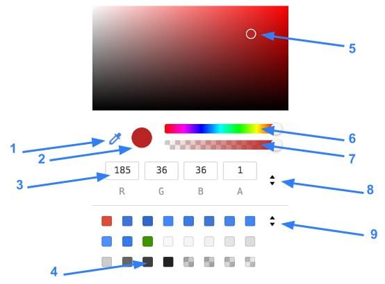
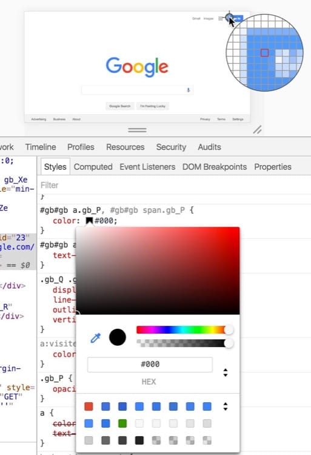
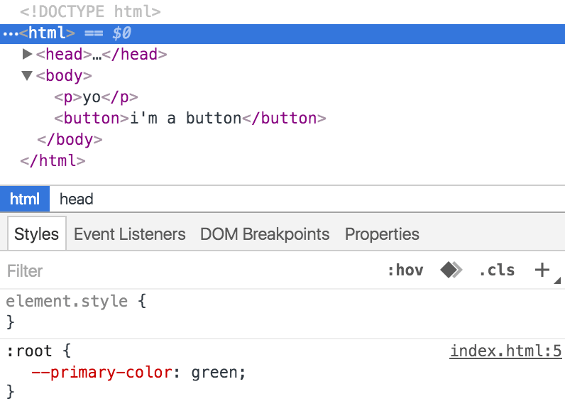
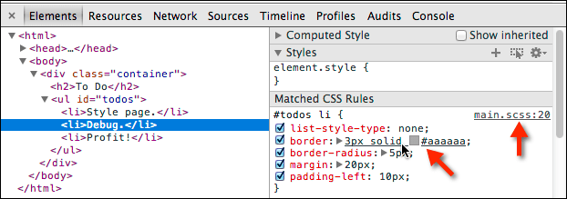
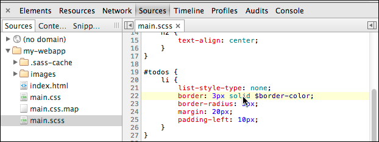

project_path: /web/tools/_project.yaml book_path: /web/tools/_book.yaml description: Use the Styles pane in Chrome DevTools to inspect and modify the CSS styles associated to an element.

{# wf_updated_on: 2018-07-27 #} {# wf_published_on: 2015-04-13 #} {# wf_blink_components: Platform>DevTools #}

# Edit Styles {: .page-title }

 

Warning: This page is deprecated. See [CSS Reference](/web/tools/chrome-devtools/css/reference).

Use the **Styles** pane to modify the CSS styles associated to an element.

### TL;DR {: .hide-from-toc }

- The styles pane lets you change your CSS in as many ways as possible, locally, including editing existing styles, adding new styles, adding rules for styles.
- If you want styles to persist (so they don't go away on a reload), you need to persist them to your development workspace.

## Inspect styles applied to an element

[Select an element](edit-dom#inspect-an-element) to inspect its styles. The **Styles** pane shows the CSS rules that apply to the selected element, from highest priority to lowest:

- At the top is `element.style`. These are styles either applied directly to the element using the style property (for example, `
`), or applied in DevTools.

- Below that are any CSS rules that match the element. For example, in the screenshot below the selected element receives `line-height:24px` from a rule defined in `tools.css`.

- Below that are inherited styles, which include any inheritable style rules that match the selected element's ancestors. For example, in the screenshot below the selected element inherits `display:list-item` from `user agent stylesheet`.

The labels on the image below correspond with the numbered items below it.

1. Styles associated with a selector that matches the element.
2. [User agent stylesheets](http://meiert.com/en/blog/20070922/user-agent-style-sheets/) are clearly labelled, and are often overridden by the CSS on your web page.
3. Rules that have been overridden by **cascading rules** are shown with strikethrough text.
4. **Inherited** styles are displayed as a group under the "Inherited from `<NODE>`" header. Click the DOM node in the header to navigate to its position in the DOM tree view. (The [CSS 2.1 properties table](http://www.w3.org/TR/CSS21/propidx.html) shows which properties are inheritable.)
5. Grey colored entries are rules that are not defined but instead **computed at runtime**.

Understanding how cascading and inheritance works is essential to debugging your styles. The cascade relates to how CSS declarations are given weights to determine which rules should take precedence when they overlap with another rule. Inheritance relates to how HTML elements inherit CSS properties from their containing elements (ancestors). For more, see [W3C documentation on cascading](http://www.w3.org/TR/CSS2/cascade.html).

## Inspect elements affected by a selector

Hover your mouse over a CSS selector in the **Styles** pane to view all elements that are affected by the selector. For example, in the screenshot below the mouse is hovering over the selector `.wf-tools-guide__section-link a`. In the live page you can see all of the `<a>` elements that are affected by the selector.

**Note**: this feature only highlights elements in the viewport; it's possible that other elements outside of the viewport are also affected by the selector.

## Add, enable, and disable CSS classes {:#classes}

Warning: This page is deprecated. See [Toggle a class](/web/tools/chrome-devtools/css/reference#toggle-class).

Click on the **.cls** button to view all of the CSS classes associated to the currently selected element. From there, you can:

- Enable or disable the classes currently associated to the element.
- Add new classes to the element. 

## Edit an existing property name or value

Warning: This page is deprecated. See [Change a declaration name or value](/web/tools/chrome-devtools/css/reference#change-declaration).

Click on a CSS property name or value to edit it. While a name or value is highlighted, press <kbd>Tab</kbd> to move forward to the next property, name, or selector. Hold <kbd>Shift</kbd> and press <kbd>Tab</kbd> to move backwards.

When editing a numeric CSS property value, increment and decrement with the following keyboard shortcuts:

- <kbd>Up</kbd> and <kbd>Down</kbd> to increment and decrement the value by 1, or by .1 if the current value is between -1 and 1.
- <kbd>Alt</kbd>+<kbd>Up</kbd> and <kbd>Alt</kbd>+<kbd>Down</kbd> to increment and decrement the value by 0.1.
- <kbd>Shift</kbd>+<kbd>Up</kbd> to increment by 10 and <kbd>Shift</kbd>+<kbd>Down</kbd> to decrement by 10.
- <kbd>Shift</kbd>+<kbd>Page Up</kbd> (Windows, Linux) or <kbd>Shift</kbd>+<kbd>Function</kbd>+<kbd>Up</kbd> (Mac) to increment the value by 100. <kbd>Shift</kbd>+<kbd>Page Down</kbd> (Windows, Linux) or <kbd>Shift</kbd>+<kbd>Function</kbd>+<kbd>Down</kbd> (Mac) to decrement the value by 100. 

## Add a new property declaration

Warning: This page is deprecated. See [Add a declaration to an element](/web/tools/chrome-devtools/css/reference#add-declaration).

Click an empty space within an editable CSS rule to create a new declaration. Type it out, or paste the CSS into the **Styles** pane. Properties and their values are parsed and entered into the correct fields.

Note: To enable or disable a style declaration, check or uncheck the checkbox next to it.

## Add a style rule

Warning: This page is deprecated. See [Add a style rule](/web/tools/chrome-devtools/css/reference#style-rule).

Click the **New Style Rule** ({:.inline}) button to add a new CSS rule.

Click and hold the button to choose which stylesheet the rule is added to.

## Add or remove dynamic styles (pseudo-classes) {:#pseudo-classes}

Warning: This page is deprecated. See [Toggle a pseudo-class](/web/tools/chrome-devtools/css/reference#pseudo-class).

You can manually set dynamic pseudo-class selectors (such as `:active`, `:focus`, `:hover`, and `:visited`) on elements.

There are two ways to set these dynamic states on an element:

- Right-click on an element within the **Elements** panel and then select the target pseudo-class from the menu to enable or disable it.
    
    

- Select an element in the **Elements** panel, click the **:hov** button in the **Styles** pane, and use the checkboxes to enable or disable the selectors for the currently selected element.
    
    

## Add background-color or color to a style rule

Warning: This page is deprecated. See [Add a background-color declaration](/web/tools/chrome-devtools/css/reference#background-color) and [Add a color declaration](/web/tools/chrome-devtools/css/reference#color).

The **Styles** pane provides a shortcut for adding `color` and `background-color` declarations to a style rule.

In the bottom-right of the style rule, there is a three-dot icon. You need to hover over the style rule in order to see it.

Hover over this icon to reveal buttons for adding a `color` declaration ({:.inline}) or a `background-color` declaration ({:.inline}). Click on one of these buttons to add the declaration to the style rule.

## Modify colors with the Color Picker {:#color-picker}

Warning: This page is deprecated. See [Change colors with the Color Picker](/web/tools/chrome-devtools/css/reference#color-picker).

To open the **Color Picker**, find a CSS declaration in the **Styles** pane that defines a color (such as `color: blue`). To the left of the declaration value there is a small, colored square. The color of the square matches the declaration value. Click on this little square to open the **Color Picker**.

You can interact with the **Color Picker** in multiple ways:

1. **Eyedropper**. See [Eyedropper](#eyedropper) for more information.
2. **Current color**. A visual representation of the **current value**. 
3. **Current value**. The hexadecimal, RGBA, or HSL representation of the **current color**. 
4. **Color palette**. See [Color palettes](#color-palettes) for more information. 
5. **Tint and shade selector**. 
6. **Hue selector**. 
7. **Opacity selector**.
8. **Color value selector**. Click to toggle between RGBA, HSL, and hexadecimal. 
9. **Color palette selector**. Click to select different templates.

### Eyedropper {:#eyedropper}

Click on the **eyedropper** button so that it is enabled ({:.inline}), hover over a color on the live page, and then click to set the currently selected declaration value to the color that you're hovering over.

### Color palettes {:#color-palettes}

The **Color Picker** provides the following color palettes:

- **Page Colors**. A set of colors automatically generated from the page's CSS.
- **Material Design**. A collection of colors consistent with the [Material Design spec](https://www.google.com/design/spec/style/color.html). 
- **Custom**. A set of any colors you choose. DevTools saves your custom palette, even across pages, until you delete it. 

#### Modifying a custom color palette {:#custom-color-palette}

Press the **plus sign** button to add the current color to the palette. Click and hold on a color to drag it to a different position, or drag it to the **trash can** icon to delete it. Right-click on a color and select **Remove color** to delete it. Select **Remove all to the right** to delete all of the colors to the right of the currently selected color. Right-click anywhere within the color palette region and select **Clear template** to delete all of the template's colors.

## View and edit CSS custom properties (CSS variables) {:#custom-properties}

You can view and edit declarations that define or use [CSS custom properties](/web/updates/2016/02/css-variables-why-should-you-care) (informally known as CSS variables) just like any other declaration.

Custom properties are usually [defined](https://drafts.csswg.org/css-variables/#defining-variables) in the `:root` selector. To view a custom property defined in `:root`, inspect the `html` element.

Custom properties do not have to be defined on the `:root` selector, however. If you defined it elsewhere, inspect the element on which it was defined to view the definition.

You can view and edit declaration values that use custom properties just like any other declaration value.

If you see a declaration value like `var(--main-color)` as in the screenshot below, it means that the declaration is using custom properties. These values can be edited like any other declaration value. Currently there is no way to jump to the custom property definition.

## Edit Sass, Less or Stylus

If you are using Sass, Less, Stylus or any other CSS preprocessor, editing the generated CSS output files in the Styles editor won't help as they don't map to your original source.

With CSS source maps, DevTools can automatically map the generated files to the original source files, which lets you live-edit these in the Sources panel and view the results without having to leave DevTools or refresh the page.

### The preprocessor workflow

When you inspect an element whose styles are provided by a generated CSS file, the Elements panel displays a link to the original source file, not the generated CSS file.

To jump to the source file:

1. Click the link to open the (editable) source file in the Sources panel.
2. <kbd class="kbd">Ctrl</kbd> + **Click** (or <kbd class="kbd">Cmd</kbd> + **click**) on any CSS property name or value to open the source file and jump to the appropriate line.

When you save changes to a CSS preprocessor file in DevTools, the CSS preprocessor should re-generate the CSS files. Then DevTools then reloads the newly-generated CSS file.

### Enable/Disable CSS source maps & auto-reloading

**CSS source maps are enabled by default**. You can choose to enable automatic reloading of generated CSS files. To enable CSS source maps and CSS reload:

1. Open DevTools Settings and click **General**.
2. Turn on **Enable CSS source maps** and **Auto-reload generated CSS**.

### Requirements & Gotchas

- **Changes made in an external editor** are not detected by DevTools until the Sources tab containing the associated source file regains focus.
- **Manual editing of a CSS file** generated by the Sass/LESS/other compiler will break the source map association until the page is reloaded.
- **Using [Workspaces](/web/tools/setup/setup-workflow)?** Make sure the generated CSS file is also mapped into the workspace. You can verify this by looking in Sources panel right-side tree, and seeing the CSS is served from your local folder.
- **For DevTools to automatically reload styles** when you change the source file, your preprocessor must be set up to regenerate CSS files whenever a source file changes. Otherwise, you must regenerate CSS files manually and reload the page to see your changes.
- **You must be accessing your site or app from a web server** (not a **file://** URL), and the server must serve the CSS files as well as the source maps (.css.map) and source files (.scss, etc.).
- If you are *not* using the Workspaces feature, the web server must also supply the `Last-Modified` header.

Learn how to setup source maps in [Setup CSS & JS Preprocessors](/web/tools/setup/setup-preprocessors).

## Emulate print media {:#emulate-print-media}

Warning: This page is deprecated. See [View a page in print mode](/web/tools/chrome-devtools/css/reference#print-mode).

To view a page in print mode:

1. Open the **Main Menu**.
2. Select **More Tools** > **Rendering Settings**. The Rendering Settings tab opens at the bottom of your DevTools window.
3. Set **Emulate media** to **Print**.

## Feedback {: #feedback }

