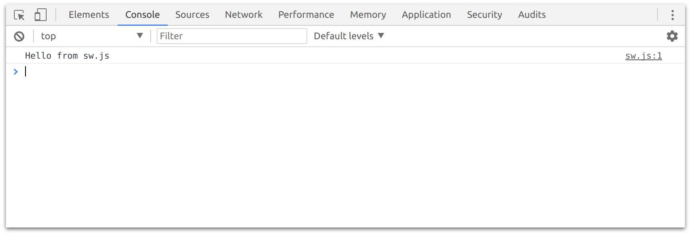
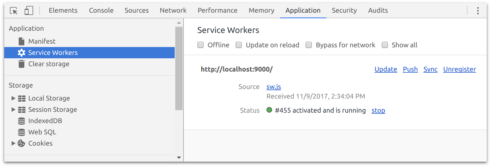
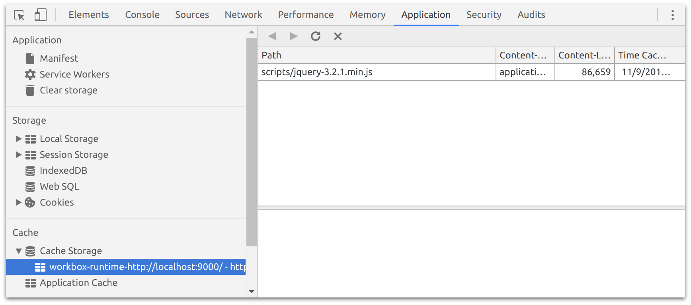

project_path: /web/tools/workbox/_project.yaml book_path: /web/tools/workbox/_book.yaml description:Get Started with Workbox.

{# wf_blink_components: N/A #} {# wf_updated_on: 2018-08-10 #} {# wf_published_on: 2017-11-15 #}

# Get Started {: .page-title }

This guide will show you how to get up and running with Workbox to route common requests for a web page and demonstrate how to cache using a common strategy.

Since most websites contain CSS, JavaScript and images, let’s look at how we can cache and serve these files using a service worker and Workbox.

## Create and Register a Service Worker File

Before we can use Workbox, we need to create a service worker file and register it to our website.

Start by creating a file called `sw.js` at the root of your site and add a console message to the file (This is so we can see it load).

```javascript
console.log('Hello from sw.js');
```

In your web page register your new service worker file like so:



This tells the browser this is the service worker to use for site.

If you refresh your page you'll see the log from your service worker file.



Looking in the “Application” tab in Chrome DevTools you should see your service worker registered.



Note: Click the “Update on reload” checkbox to make it easier to develop with your new service worker.

Now that we have a service worker registered, let’s look at how we can use Workbox.

## Importing Workbox

To start using Workbox you just need to import the `workbox-sw.js` file in your service worker.

Change your service worker so that it has the following `importScripts()` call.

<pre class="prettyprint js">importScripts('');

if (workbox) {
  console.log(`Yay! Workbox is loaded 🎉`);
} else {
  console.log(`Boo! Workbox didn't load 😬`);
}
</pre>

With this you should see the “Yay” message so we know that Workbox is officially loaded in our service worker.


Now we can start using Workbox.

Warning: Importing `workbox-sw.js` will create a [`workbox` object](/web/tools/workbox/modules/workbox-sw) inside of your service worker, and that instance is responsible for importing other helper libraries, based on the features you use. Due to restrictions in the [service worker specification](https://www.chromestatus.com/feature/5748516353736704), these imports need to happen either inside of an `install` event handler, or synchronously in the top-level code for your service worker. More details, along with workarounds, can be found in the [`workbox-sw` documentation](/web/tools/workbox/modules/workbox-sw#avoid_async_imports).

## Using Workbox

One of Workbox’s primary features is it’s routing and caching strategy modules. It allows you to listen for requests from your web page and determine if and how that request should be cached and responded to.

Let’s add a cache fallback to our JavaScript files. The easiest way to do this is to register a route with Workbox that will match any “.js” files that are requested, which we can do with a regular expression:

```javascript
workbox.routing.registerRoute(
  new RegExp('.*\.js'),
  …
);
```

This tells Workbox that when a request is made, it should see if the regular expression matches part of the URL, and if it does, do something with that request. For this guide, that “do something” is going to be passing the request through one of Workbox’s caching strategies.

If we want our JavaScript files to come from the network whenever possible, but fallback to the cached version if the network fails, we can use the “network first” strategy to achieve this.

```javascript
workbox.routing.registerRoute(
  new RegExp('.*\.js'),
  workbox.strategies.networkFirst()
);
```

Add this code to your service worker and refresh the page. If your web page has JavaScript files in it, you should see some logs similar to this:


Workbox has routed the request for any “.js” files and used the network first strategy to determine how to respond to the request. You can look in the caches of DevTools to check that the request has actually been cached.



Workbox provides a few caching strategies that you can use. For example, your CSS could be served from the cache first and updated in the background or your images could be cached and used until it’s a week old, after which it’ll need updating.

```javascript
workbox.routing.registerRoute(
  // Cache CSS files
  /.*\.css/,
  // Use cache but update in the background ASAP
  workbox.strategies.staleWhileRevalidate({
    // Use a custom cache name
    cacheName: 'css-cache',
  })
);

workbox.routing.registerRoute(
  // Cache image files
  /.*\.(?:png|jpg|jpeg|svg|gif)/,
  // Use the cache if it's available
  workbox.strategies.cacheFirst({
    // Use a custom cache name
    cacheName: 'image-cache',
    plugins: [
      new workbox.expiration.Plugin({
        // Cache only 20 images
        maxEntries: 20,
        // Cache for a maximum of a week
        maxAgeSeconds: 7 * 24 * 60 * 60,
      })
    ],
  })
);
```

## What Else Can Workbox Do?

Routing and caching strategies are performed by the `routing` and `strategies` modules, but there are plenty of other modules, each offering specific behaviors that you can use in your service worker.

You'll find a number of guides that cover other features of Workbox as well as more information on configuring Workbox. Find a full list on the left, but the next natural step is to enable precaching, which is the process of adding files to the cache when your service worker loads.

<a href="./precache-files" class="button">Learn More About Precaching</a>
